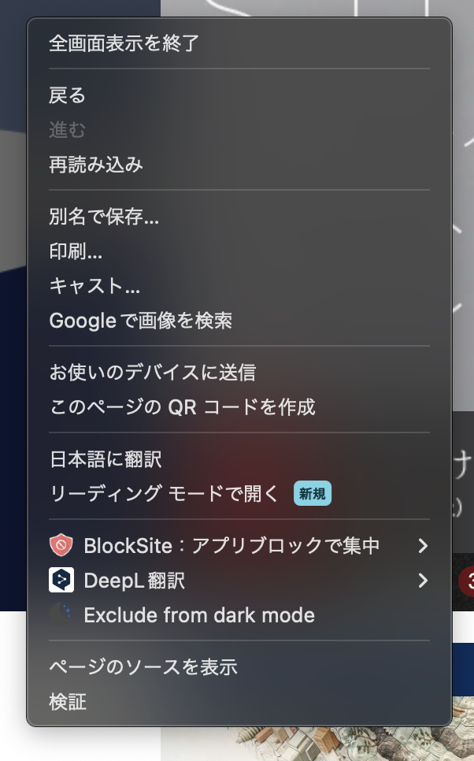
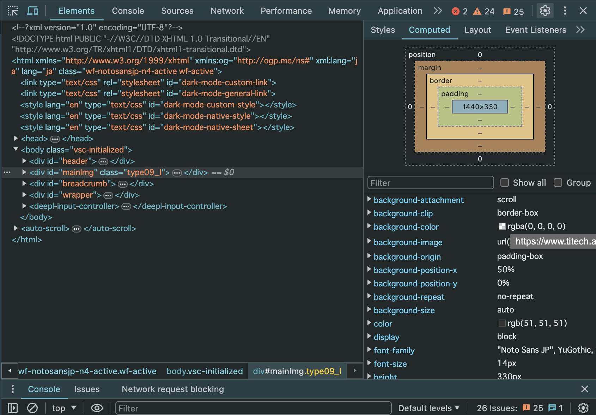
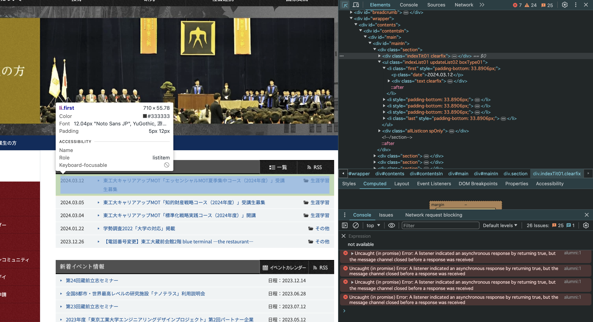
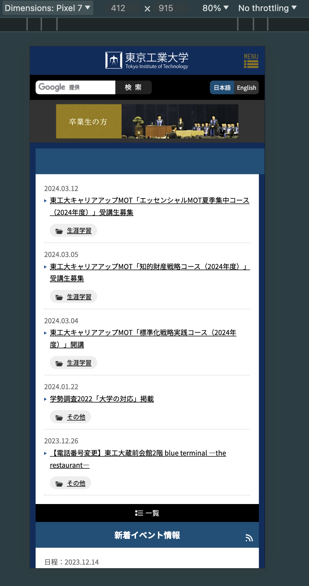
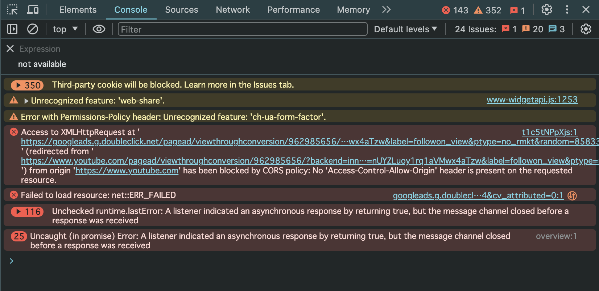
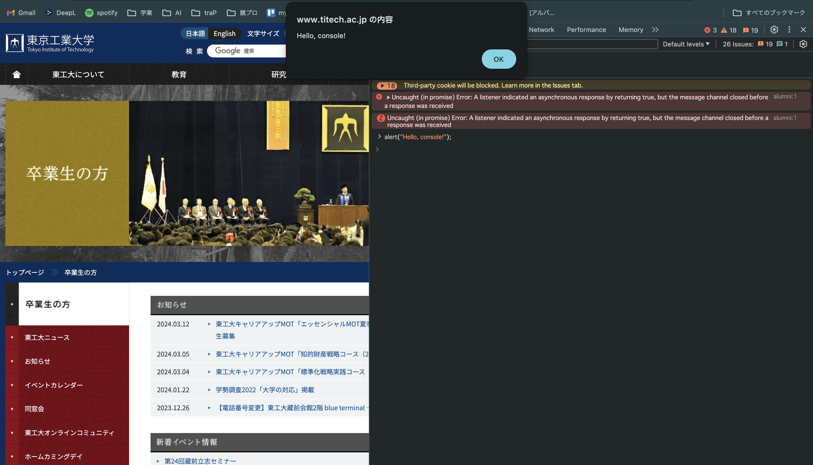
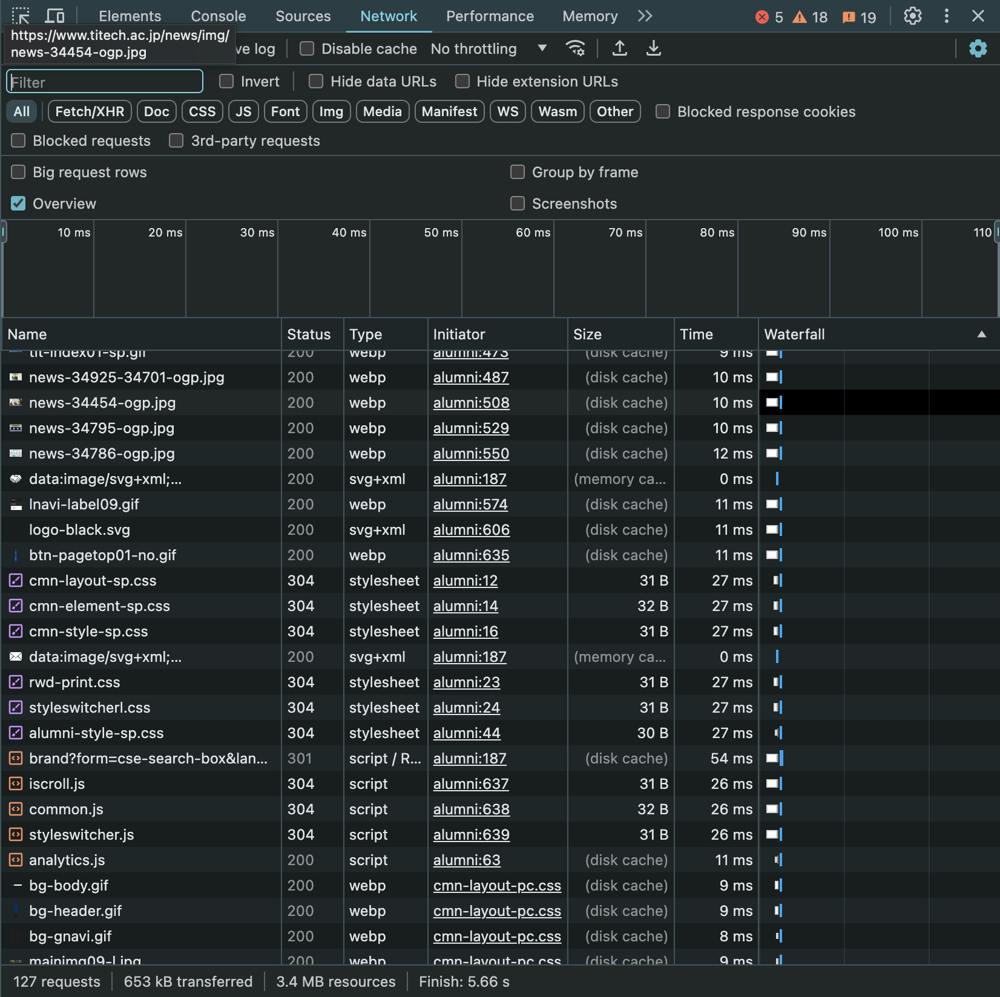
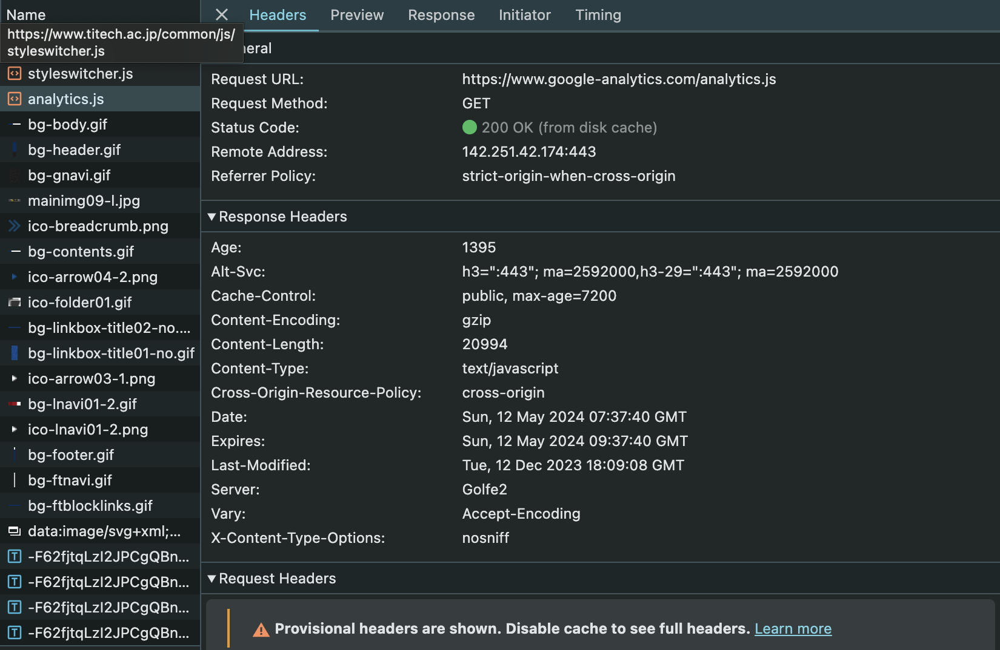
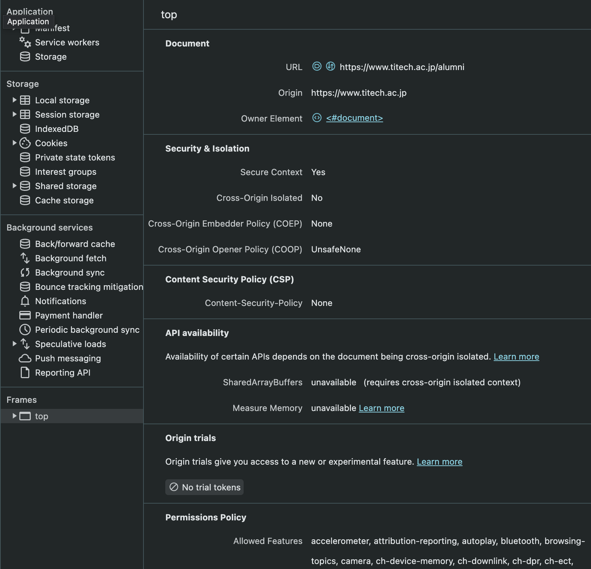
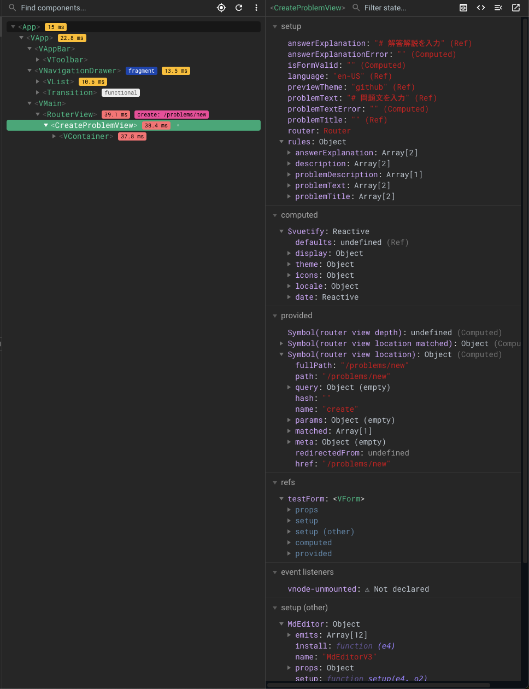

# DevToolsについて
この章では、Webアプリ開発において欠かせないDevToolsについて説明します。DevToolsはさまざまなWebブラウザにある機能ですが、今回はChrome DevToolsを題材に説明を進めます。なお、この章では基本的な内容を中心に扱っていますので、DevToolsについてより詳細に知りたい人は[Chrome DevToolsの公式ドキュメント](https://developer.chrome.com/docs/devtools?hl=ja)などを参照してください。
[[toc]]
## DevToolsって何？
DevToolsとは、Webブラウザに直接組み込まれたウェブデベロッパーツールのセットです。これを使うことにより、そのページで使われているCSSを把握したり、どのようなエラーが生じているかを確認したりと、Web開発に必要な非常に多くのことを実現することができます。
## DevToolsの開き方
DevToolsの開き方はいくつかありますが、ここではそのうちの2つを紹介します。

最初に、ChromeメニューからDevToolsを開く方法を紹介します。まず、DevToolsを開きたいページでマウスを右クリックします。すると、次のようなメニューが表示されると思います。



このメニューの「検証」をクリックすると次のような画面が開かれると思います。これがDevToolsです。


併せて、ショートカットを利用してDevToolsを開く方法を紹介します。最も一般的な方法として、DevToolsを開きたいページで`F12`(環境によっては`Fn+F12`)を押すというものがあります。また、WindowsまたはLinuxの場合は`Ctrl+Shift+C`で、Macの場合は`Cmd+Option+C`でDevToolsのElement(要素)タブを開くこともできます。そのほかにもいくつかのショートカットがあり、詳細は[Chrome DevToolsを開く](https://developer.chrome.com/docs/devtools/open?hl=ja)というドキュメントのページを参照してください。

もし、DevToolsが表示される場所を変えたければ、DevToolsの右上の方にある３つ点が並んだアイコンをクリックし、Dock sideという項目からお好きな位置を選んでください。

## DevToolsの機能の紹介
ここからは、DevToolsの機能のうち基本的かつ重要な内容について取り上げて説明します。この章を読んでいる皆さんも、手元でDevToolsを開いて実際に触りながら学習を進めてください。

具体的な機能の紹介に入る前に、DevToolsの言語設定を変更する方法を紹介しておきます。上記の手順でDevToolsを開いたら、右上の歯車マークをクリックしてください。すると、Setting画面が開かれますので、この画面のLanguageタブからお好みの言語を選択してください。


### Elementについて
まず、Elements(要素)について説明します。
DevToolsを開いてElementsタブを選択すると、次のような画面が表示されると思います。



このパネルには、DevToolsを開いたページ全体のDOMとCSSが表示されています。もし個別の要素について詳しく調査したければ、DevToolsの左上に表示されているInspect(検査)アイコンをクリックしましょう。この状態でページ上でカーソルを動かすと焦点が当たっている要素についての詳細な情報が表示されます。またInspectモードのまま各要素をクリックすると、パネルのDOMツリーのうちクリックした要素に対応する部分がハイライト表示されます。



さらに下の写真で示すように、ElementのパネルやStyleタブ、LayoutタブなどからCSS等を直接書き換えることもできます。


また、Inspectアイコンの隣にあるアイコンをクリックすると、PC上でスマホなどのモバイル機器での表示を確認することができます。例えば、該当のアイコンをクリックした時に表示されるDimensionsタブからPixel7を選択すると、下の写真のように実際にPixel7で同じページを開いた時と同様の表示がなされます。この機能により、PCを使いながら他のモバイル機器での表示を簡単に確認することができます。



### Consoleについて
次に、Consoleについて説明します。
DevToolsを開いてConsoleタブを選択すると、次のような画面が表示されると思います。



ここにはアプリケーションのすべてのログやエラーが表示されます。これを見ることにより、開発中に生じたエラーの詳細がわかり、エラーを解決するための手助けとなります。
また、これに関連したConsoleの便利な使い方として、`console.log`を用いたプリントデバッグがあります。例えば、開発の際にある変数にどのような変数が入っているかを知りたいと思ったら、コード中に`console.log(hoge)`のように書いておくことで、`hoge`の内容をコンソールに表示することができます。非常に便利ですので是非覚えておいてください。

さらに、ConsoleではJavaScriptのコードを実行することもできます。例えば、次のようなコードをConsoleに直接入力してみてください。
```js
alert("Hello,Console!")
```
うまくいけば次のように表示されると思います。



直接入力する他にコードファイルをドラック&ドロップすることでもコードを実行することができますので、覚えておくと良いかもしれません。


### Networkについて
DevToolsを開いてNetworkタブを選択すると、次のような画面が表示されると思います。



ここでは、ページを開いたときのネットワークアクティビティーを知ることができます。jsファイルやcssファイル、画像やフォントなどそのページで読み込む必要があるすべてのファイルについて、読み込み時のステータスや読み込みにどれくらいかかったかを知ることができます。

例えば下の写真を見てみると、analytics.jsというファイルはStatusが200であることから正しく読み込まれていて、また読み込みには11msかかったことを知ることができます。


もし何らかの理由で正しく読み込まれていないときは、Statusに404(Not Found)などが表示されているでしょう。もし詳細について知りたければ、各ファイルのName欄をクリックすれば良いです。各ファイルのName欄をクリックすると次のような画面が表示されると思います。少し込み入った話になるので省略しますが、例えばHeadersタブを見てHTTPヘッダーを調べることができたり、Timingタブからネットワークアクティビティの内訳を調べることができたりします。



### Applicationについて
DevToolsを開いてApplicationタブを選択すると、次のような画面が表示されると思います。



ここではマニフェスト、Service Worker、ストレージ、キャッシュデータなど、Webアプリのさまざまな要素を検査したりデバッグしたりすることができます。パネルの左側を見るとApplication,Storage,Background services、Framesという4つの大きな区分けがあり、その下に様々な項目があると思います。このすべての項目について説明することが難しいので、区分けごとに簡単な解説をするにとどめます。

Applicationの項目にはマニフェスト(manifest.jsonに含まれる名前やversionなどの情報)、Service Worker(ウェブアプリケーション、ブラウザー、そしてネットワークの間に介在するプロキシサーバーのように振る舞うもの)、ストレージなどアプリに関する全般的な情報が含まれます。

Storageの項目には、そのページで使用されているさまざまなストレージ方法と保存された内容が含まれており、それらを確認したり編集したりできます。例えばStorageのCookiesの項目では、Valueのカラムをダブルクリックすることにより値を編集することができます。

Background servicesの項目では、キャッシュに関するテストを実行したり支払いハンドラのイベントを記録したりと、バックグラウンドサービスの検査、テスト、デバッグをすることができます。

Frameの項目では、Webページを複数に分割し、個別に読み込んで確認することができます。

## 補足(Vue.js devtools)
最後に補足として、Vue.js devtoolsについて触れておきます。これはVueでの開発体験をよりよくするために開発された拡張機能で、なろう講習会でも後々入れてもらうことになります。拡張機能の導入に際しては[公式ドキュメント](https://devtools.vuejs.org/guide/installation.html)も参照してください。

詳しい使い方は実際に使ってみるときに確認していただきたいのですが、例えばComponentsタブからは、コンポーネント間の親子関係を確認したり、各コンポーネントの親子関係を確認したり、コンポーネントが持っているデータを見たりすることができます。


## 最後に
ここではDevToolsの基本的な内容について説明しました。ぜひこれから、Webアプリを制作していて何かうまくいかないことがあればDevToolsを見る、という習慣をつけていきましょう。
最初にも述べましたが、DevToolsについてより詳細に知りたい人は公式のドキュメントなどを読んでください。

