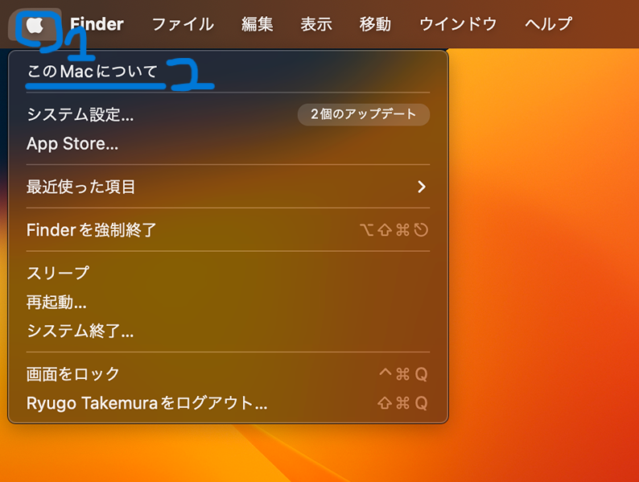

# 環境構築

[[toc]]

::: tip

質問をするときにはできるだけスクリーンショットを貼るようにしましょう。テキストだけで説明しても解決に必要な情報を全て伝えるのは難しいです。

Mac: `Control + Shift + Command + 4`を押すと、矩形選択でスクリーンショットが撮れます。 traQ のメッセージ入力欄に`Command + V`で貼り付けられます。  
Windows: `Winキー + Shift + S`を押すと、矩形選択でスクリーンショットが撮れます。 traQ のメッセージ入力欄に`Ctrl + V`で貼り付けられます。
:::

## VSCode 拡張機能の導入

- [Go](https://marketplace.visualstudio.com/items?itemName=golang.Go)

::: info
コマンドは手打ちではなくてコピー&ペーストで打ってください。
手打ちだと写し間違いをする可能性があります。
:::

## Go のインストール

直接インストールする方法と asdf を使ったインストールの 2 種類がありますが、asdf を使った方が後からバージョンを上げるのが簡単になるので、長期的にオススメです。
どちらか好みのほうを選択しましょう。

::: info
コマンドは一行ずつ実行してください。
:::

### 直接インストールする方法

https://golang.org/doc/install  
インストールが終わった後に`go version`してみて`go version go1.20.5`と出れば成功です。
#### Mac

Mac のタブを選択し、ダウンロードページに飛んで自分のアーキテクチャの pkg をダウンロード=>インストーラ起動で設定完了です。

もしくは`brew install go@1.20`を実行してください。

::: info
M1/M2 Mac の人は Apple macOS (ARM64) を、Intel Mac の人は Apple macOS (x86-64) を選択してください。

::: details 確認方法
1. 左上の :apple: のアイコンから、「このMacについて」
2. 画像の青枠の場所で確認できます。



:::


#### Windows (WSL2)
``` bash
sudo apt install tar git
wget https://go.dev/dl/go1.20.5.linux-amd64.tar.gz
sudo rm -rf /usr/local/go && sudo tar -C /usr/local -xzf go1.20.5.linux-amd64.tar.gz
echo 'export PATH=$PATH:/usr/local/go/bin' >> ~/.bash_profile
source ~/.bash_profile
```

### with asdf(バージョン管理ツール)

asdf を導入したのち、 asdf 経由で go を導入します。

#### asdf導入

[公式資料](https://asdf-vm.com/#/core-manage-asdf)
::: code-group
``` bash [Windows(WSL2)]
sudo apt install git
git clone https://github.com/asdf-vm/asdf.git ~/.asdf --branch v0.11.3
echo '. $HOME/.asdf/asdf.sh' >> ~/.bashrc
echo '. $HOME/.asdf/completions/asdf.bash' >> ~/.bashrc
source ~/.bashrc
```
``` zsh [Mac]
brew install asdf
echo -e '\n. $(brew --prefix asdf)/libexec/asdf.sh' >> ${ZDOTDIR:-~}/.zshrc
source ~/.zshrc
```
:::
##### Go の導入

``` bash
asdf plugin add golang
asdf install golang 1.20.5
asdf global golang 1.20.5
```

## Docker Desktopのインストール

https://www.docker.com/products/docker-desktop/  
上のリンクからそれぞれの OS にあったものをダウンロードしてインストールしてください。

:::info
Mac は M1/M2 の場合、 Apple Chip を、Intel の場合、Intel Chip を選択してください。
:::

インストール後起動したら、以下の手順に従って、Compose v2 を有効化してください。

### Compose V2 の有効化
1. 右上の歯車アイコンから `General` に移動する。
2. 下にスクロールし、`Use Docker Compose V2` にチェックを入れる
4. 最後に、右下の `Apply & Restart` をクリックして設定は完了です。


### WSL2の追加設定
#### WSL Backendの有効化

1. 右上の歯車アイコンから `Resources` => `WSL Integration` に移動する。
2.  `Enable integration with my default WSL distro`にチェックを入れる。
3. 下に出てくる Distro をすべて有効化する。
4. 最後に、右下の `Apply & Restart` をクリックして設定は完了です。


