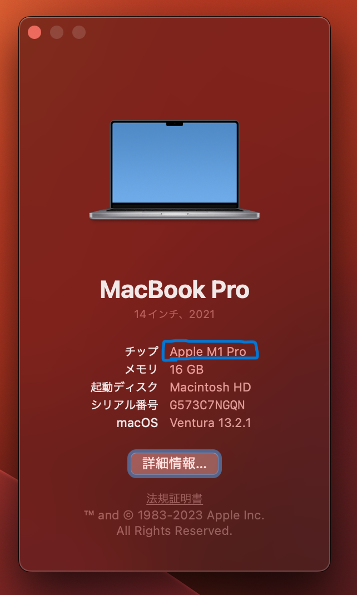

# 環境構築

[[toc]]

::: tip
質問をするときにはできるだけスクリーンショットを貼るようにしましょう。テキストだけで説明しても解決に必要な情報を全て伝えるのは難しいです。

Mac: `Control + Shift + Command + 4`を押すと、矩形選択でスクリーンショットが撮れます。 traQ のメッセージ入力欄に`Command + V`で貼り付けられます。

Windows: `Winキー + Shift + S`を押すと、矩形選択でスクリーンショットが撮れます。 traQ のメッセージ入力欄に`Ctrl + V`で貼り付けられます。
:::

:::warning
コマンドは手入力ではなく、コピー & ペースト で入力してください。  
手入力だと写し間違いの可能性があります。  
この際、1 行ずつコピーするようにしてください。
:::

## 事前準備

:::info
以下の作業では、Mac と Windows で手順が違います。
まずは自分の PC の OS を以下から選んでください。

<div style="font-size: 1.2rem; font-weight: bold;">
    <input type="radio" id="windows" value="windows" v-model="userOs" />
    <label for="windows">Windows</label>
    <br>
    <input type="radio" id="unix" value="unix" v-model="userOs" />
    <label for="unix">macOS / Linux</label>
</div>
:::

<div v-if="userOs==='windows'">
<h3>WSL の導入</h3>

すでに WSL をインストールしている方はこの手順を飛ばして大丈夫です。

WSL は Windows 上で Linux を動かすための仕組みで、`Windows Subsystem for Linux`の略です。

以下のページの Step 1 を行ってください。 Step 2 以降は行わなくて大丈夫です。

https://pg-basic.trap.show/text/chapter-0/enviroment/windows.html#step-1-install-wsl
</div>

<div v-if="userOs==='unix'">
<h3>Homebrew の導入</h3>

`ターミナル`アプリを開いて、以下のコマンドを貼り付け、`return`キーを押して実行してください。

Homebrew とは、様々なアプリケーションをインストールしやすくし、アップデートなどもやりやすくするためのソフトです。

```bash
/bin/bash -c "$(curl -fsSL https://raw.githubusercontent.com/Homebrew/install/HEAD/install.sh)"
```

参考: https://brew.sh/index_ja
</div>

<div v-if="userOs!==undefined">

## VSCode の導入

すでに VSCode をインストールしている方はこの手順を飛ばして大丈夫です。

以下のサイトから使用している OS に合った VSCode のインストーラーをダウンロードして、それを実行してインストールしてください。

https://code.visualstudio.com/download

### 拡張機能の導入

VSCode は拡張機能により様々な言語でのプログラミングをラクにすることができます。  
次回以降に使うものも最初にまとめて導入しておきましょう。

- [Go](https://marketplace.visualstudio.com/items?itemName=golang.Go)
  - Go 言語で書いたコードをチェックしてくれたり、プログラムを書くときに補完 (予測変換のような機能) を使えるようになったりします。
- [ESLint](https://marketplace.visualstudio.com/items?itemName=dbaeumer.vscode-eslint)
  - コードの書き方をチェックしてくれます。
- [Prettier - Code formatter](https://marketplace.visualstudio.com/items?itemName=esbenp.prettier-vscode)
  - コードのフォーマットを整えてくれます。保存時に自動で実行されるような設定をしておくと便利です。
- [Vue Language Features (Volar)](https://marketplace.visualstudio.com/items?itemName=vue.volar)
  - VSCode の Vue3 向けの統合プラグイン。  

インストールが終わったら、反映させるために VSCode を 1 度閉じて開きなおしてください。

## Go と Task のインストール

直接インストールする方法と asdf を使ったインストールの 2 種類がありますが、asdf を使った方が後からバージョンを上げるのが簡単になるので、長期的にオススメです。
どちらか好みのほうを選択しましょう。

### 直接インストールする方法

https://golang.org/doc/install  
インストールが終わった後に`go version`してみて`go version go1.22.2`と出れば成功です。

<div v-if="userOs==='unix'">

Mac のタブを選択し、ダウンロードページに飛んで自分のアーキテクチャの pkg をダウンロード=>インストーラ起動で設定完了です。

もしくは Homebrew がすでにインストールされている人は、`brew install go@1.20`を実行することでも導入できます。

::: info
M1/M2 Mac の人は Apple macOS (ARM64) を、Intel Mac の人は Apple macOS (x86-64) を選択してください。

::: details 確認方法

1. 左上の :apple: のアイコンから、「この Mac について」
2. 画像の青枠の場所で確認できます。



:::
</div>

<div v-if="userOs==='windows'">

``` bash
sudo apt install tar git
wget https://go.dev/dl/go1.22.2.linux-amd64.tar.gz
sudo rm -rf /usr/local/go && sudo tar -C /usr/local -xzf go1.22.2.linux-amd64.tar.gz
echo 'export PATH=$PATH:/usr/local/go/bin' >> ~/.bash_profile
source ~/.bash_profile
```

</div>

### with asdf(バージョン管理ツール)

asdf を導入したのち、 asdf 経由で go を導入します。

#### asdf導入

[公式資料](https://asdf-vm.com/#/core-manage-asdf)

::: code-group

``` bash [Windows(WSL2)]
sudo apt install git
git clone https://github.com/asdf-vm/asdf.git ~/.asdf --branch v0.11.3
echo '. $HOME/.asdf/asdf.sh' >> ~/.bashrc
echo '. $HOME/.asdf/completions/asdf.bash' >> ~/.bashrc
source ~/.bashrc
```

``` zsh [Mac]
brew install asdf
echo -e '\n. $(brew --prefix asdf)/libexec/asdf.sh' >> ${ZDOTDIR:-~}/.zshrc
source ~/.zshrc
```

:::

##### Go の導入

``` bash
asdf plugin add golang
asdf install golang 1.22.2
asdf global golang 1.22.2
```

### Go のツールのインストール

VSCode で Windows ならば`Ctrl`+`Shift`+`P`、Mac ならば`Command`+`Shift`+`P`を押して出てくるコマンドパレットに`gotools`と入力して、出てきた「Go: Install/Update Tools」をクリックしてください。


利用可能なツールの一覧が出てくるので、全てにチェックを入れて「OK」をクリックします。

出力で`All tools successfully installed. You are ready to Go. :)`と出ているのが確認できたら成功です。

## Taskのインストール

Go をインストールした方法に応じて、以下をコマンドラインで実行してください。

:::code-group

```sh [asdf (WSL, Mac)]
go run github.com/go-task/task/v3/cmd/task@latest init
asdf reshim golang
```

```sh [直接 (WSL, Mac)]
go run github.com/go-task/task/v3/cmd/task@latest init
```

:::

:::info 詳しく知りたい人向け。

**`task`って何だ。**

Task は、Go で動いているタスクランナーです。これによって長いコマンドを短くできたり、複数のコマンドを 1 回で実行できたりと、開発においてとても便利なツールです。テンプレートリポジトリに`Taskfile.yaml`というファイルがありますが、このファイルによってコマンドの設定をしています。公式ドキュメントは英語しかありませんが、興味のある人は目を通してみてください。

Task 公式ドキュメント [https://taskfile.dev/](https://taskfile.dev/)

Task GitHub [https://github.com/go-task/task](https://github.com/go-task/task)

:::

## Node.jsの導入

Vue を使うために、Node.js を入れます。自分の環境に合わせたものを選んで実行してください。

### 簡単

前の章で asdf を使って Go をインストールした人はこちらではなくて、「バージョン管理を考える」の方を見てください。

<div v-if="userOs==='unix'">

#### mac

1. Homebrew を用いてインストール

```zsh
$ brew install node
```

2. PATH を通す

前述のコマンドを実行すると、最後に`If you need to have node first in your PATH, run:`というメッセージが出るので、これに続くコマンドを実行してください。

3. バージョンを確認

```zsh
$ node -v
```

上記のコマンドを実行して、バージョン番号が表示されれば OK。

</div>
<div v-if="userOs==='windows'">

#### Windows(WSL)

```bash
$ curl -fsSL https://deb.nodesource.com/setup_current.x | sudo -E bash -
$ sudo apt-get install -y nodejs
```

バージョンを確認します。

```bash
$ node -v
```

を実行して、バージョン番号が表示されれば OK。
</div>

### バージョン管理を考える

Go のインストールにも用いた asdf を用いてインストールすることで、プロジェクトごとに自動で手元の Node.js のバージョンを変えることができます。

```bash
$ asdf plugin add nodejs
$ asdf install nodejs latest
$ asdf global nodejs latest
```

これで、デフォルトで現在出ている最新のバージョンが適用されるようになりました。

```bash
$ node -v
```

を実行して、バージョン番号が表示されれば OK。

## Docker Desktopのインストール

https://www.docker.com/products/docker-desktop/  
上のリンクからそれぞれの OS にあったものをダウンロードしてインストールしてください。

<div v-if="userOs==='unix'">

:::info
Mac は M1/M2 の場合、 Apple Chip を、Intel の場合、Intel Chip を選択してください。
:::

</div>

<div v-if="userOs==='windows'">

<h3>WSL2の追加設定 - WSL Backend の有効化</h3>

1. 右上の歯車アイコンから `Resources` => `WSL Integration` に移動する。
2. `Enable integration with my default WSL distro`にチェックを入れる。
3. 下に出てくる Distro をすべて有効化する。
4. 最後に、右下の `Apply & Restart` をクリックして設定は完了です。


</div>

## Postmanのインストール

[Postman | API Development Environment](https://www.getpostman.com/) は GUI で HTTP リクエストを行えるアプリケーションです。

[ダウンロードページ](https://www.postman.com/downloads/)

</div>

<script setup lang="ts">
import { ref } from 'vue'
const userOs = ref();
</script>
