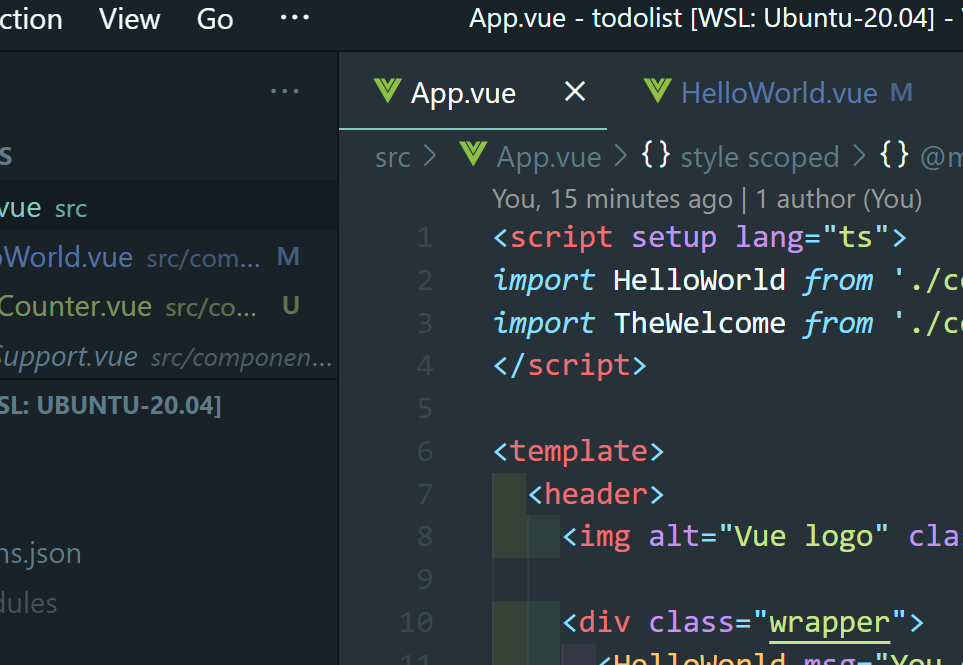

# Vue 入門

:::warning
コマンドやコードを示すときに`{ユーザー名}`のような表記をすることがありますが、これは実際には自分の情報に合わせて`{}`を取り除いた上で、自分のユーザー名を入力してください。

`git clone`するときの例を挙げてみます。

```bash
$ git clone {リポジトリのURI}
```

上のように書いてあって traQ のリポジトリをクローンする場合、以下のように自分がクローンしたいリポジトリの URI を入力します。

```bash
$ git clone git@github.com:traPtitech/traQ.git
```

このような表記はしばしば出てくるので、`{}`をつけたまま書いてしまわないように気をつけましょう。

:::

## Node.jsの導入
Vue を使うために、Node.js を入れます。自分の環境に合わせたものを選んで実行してください。

### 簡単
前の章で asdf を使って Go をインストールした人はこちらではなくて、「バージョン管理を考える」の方を見てください。
#### mac
1. brew を用いてインストール

```zsh
$ brew install node
```
2. PATH を通す

1.を実行すると、最後に`If you need to have node first in your PATH, run:`というメッセージが出るので、これに続くコマンドを実行してください。

3. バージョンを確認

```zsh
$ node -v
```

を実行して、`20.3.0`と表示されれば OK。

#### Windows(WSL)
```bash
$ curl -fsSL https://deb.nodesource.com/setup_20.x | sudo -E bash -
$ sudo apt-get install -y nodejs
```

2. バージョンを確認

```bash
$ node -v
```

を実行して、`20.3.0`と表示されれば OK。

### バージョン管理を考える
Go のインストールにも用いた asdf を用いてインストールすることで、プロジェクトごとに自動で手元の Node.js のバージョンを変えることができます。

```bash
$ asdf plugin add nodejs
$ asdf install nodejs 20.3.0
$ asdf global nodejs 20.3.0
```

これで、デフォルトで 20.3.0 のバージョンが適用されるようになりました。

```bash
$ node -v
```

を実行して、`20.3.0`と表示されれば OK。

## Vue テンプレートのクローン

`~/develop`ディレクトリの中にテンプレートリポジトリをクローンしてプログラムを書きます。  
予め設定等が準備されたテンプレートリポジトリを用いて、最終的には TodoList を作っていきます。

GitHub に SSH 鍵を登録していない人は以下を参考にしてまず登録してください。

[SSH鍵の登録](../dicts/ssh/0_index.md)

[traPtitech/naro-template-frontend](https://github.com/traPtitech/naro-template-frontend) にアクセスし、「Use this template」→「Create a new repository」をクリックしてください。


「Repository name」にリポジトリ名を入力、公開状態は TA が見られるように「Public」にしてください。


「Create repository from template」でリポジトリを作成したら手元にクローンしてください。  
`cd {リポジトリ名}`でプロジェクトのディレクトリに移動し、`code .`で VSCode を開きます。

開いたプロジェクトの中に入っている`package.json`というファイルには npm に関する様々な設定が書かれています。
この中には依存するパッケージ一覧も含まれており、以下のコマンドでそれらをインストールできます。

`$ npm i`  
もしくは  
`$ npm install`

```bash
mehm8128@DESKTOP-6F4C0KI ~/develop/todolist-mehm8128 (main)$ npm i

added 130 packages, and audited 131 packages in 2s

20 packages are looking for funding
  run `npm fund` for details

1 moderate severity vulnerability

To address all issues, run:
  npm audit fix

Run `npm audit` for details.
```

テンプレートは初期状態でビルド&配信できるようになっているので、以下のコマンドを実行してブラウザで確認してみましょう。

`$ npm run dev`

```bash
mehm8128@DESKTOP-6F4C0KI ~/develop/todolist-mehm8128 (main)$ npm run dev

> todolist@0.0.0 dev
> vite


  VITE v4.3.8  ready in 611 ms

  ➜  Local:   http://localhost:5173/
  ➜  Network: use --host to expose
  ➜  press h to show help

```

この状態で、ブラウザから <a href='http://localhost:5173/' target="_blank" rel="noopener noreferrer">localhost:5173</a> にアクセスすると、以下のような画面が表示されるはずです。


止めるときは`Ctrl + C`で止めてください。

## Vue 入門

### Vue とは

以下のリンクから公式ドキュメントに飛ぶことができます。  
[Vue](https://ja.vuejs.org/)

traP では、Web フロントフレームワークとして最も多く使われているフレームワークで、traQ、traPortal、Showcase、anke-to、knoQ などで使われています。

### `.vue`ファイルについて

Vue では`.vue`という拡張子で単一ファイルコンポーネント(SFC, Single File Component)を作ることができます。

なろう講習会の言葉で言うと、Vue では、**1 つの同じファイルに構造(HTML)・ロジック(JavaScript)・スタイル(CSS)** を記述できます。それぞれを別の巨大なファイルに書くのではなく、**見た目に対応した要素を各ファイルに分割して書く**ことで、それぞれの責任範囲をより直感的な形式で分けることができるわけです。このように分けられた要素をコンポーネントといいます。

### Vue の書き方

- `<script>`タグ内にロジック
- `<template>`タグ内に構造
- `<style>`タグ内にスタイル

を記述します。

#### Sample.vue

<<< @/chapter1/section2/src/0/Sample.vue

#### 使用例

traQ で 1 つ例を挙げると、メッセージの表示部分はコンポーネントとして定義されています。
メッセージも複数のコンポーネントから構成されています。

[https://github.com/traPtitech/traQ_S-UI/blob/master/src/components/Main/MainView/MessageElement/MessageElement.vue](https://github.com/traPtitech/traQ_S-UI/blob/master/src/components/Main/MainView/MessageElement/MessageElement.vue)

- メッセージ情報(ユーザー名、画像、ファイル等)の構造(HTML)
- メッセージにスタンプをつける等のロジック(TypeScript)
- それらのスタイルを記述するスタイル(Scss)

が 1 つのファイルに纏められていることがわかります(このファイルはたった 130 行程度ですが、traQ にはコンポーネントが 300 個以上あります。 これがそれぞれの HTML、 CSS、 JavaScript のファイルに書かれていると想像してみると...)。

### プロジェクト構造

```
.
├── index.html              // 最初にブラウザに読まれるHTMLファイル
├── node_modules/           // 依存ライブラリの保存先
├── package-lock.json       // 依存ライブラリ(詳細)
├── package.json            // 依存ライブラリ・タスク・各種設定
├── public
│   └── favicon.ico         // 静的ファイル(ビルドされない)
├── src
│   ├── App.vue             // main.jsから読まれる.vueファイル(Vueの処理開始点)
│   ├── images              // Vueで使用したい画像など
│   │　　└── logo.svg
│   ├── components          // 各種コンポーネント
│   │　　└── HelloWorld.vue
│   └── main.ts　　　　　　　　// index.htmlから読まれるscript(TSの処理開始点)
└── vite.config.ts
```

#### `index.html`

Vite はここから参照されているファイルをたどってビルドを進めていきます。
ここに必要なものを書き加えることもありますが、基本的には書き換えません。
マウント用の`<div id="app"></div>`と`main.js`の読み込みが書かれています。

#### `node_modules`

`npm install` でインストールされる依存ライブラリが保存されるディレクトリです。
中を見ることは殆ど無いです。
`.gitignore`に指定されています。(`package.json`, `package-lock.json` があれば `npm install` で再現できるためです)

#### `package.json` `package-lock.json`

プロジェクトに関するメタ情報や、`npm run ~~`で実行できるタスク、依存ライブラリの情報が記述されています。

#### `src/main.ts`

`index.html` で読み込まれている ts ファイルです。
ここでは Vue インスタンスを生成し、`index.html` の`<div id="app"></div>`部分にマウントしています。

#### `src/App.vue`

Vue としてのエントリーポイントです。
HelloWorld コンポーネントを読み込み → 登録 → 描画しています。

#### `src/components/HelloWorld.vue`

ここと似たようなものをどんどん書いていきます。
`App.vue`で呼び出されています。  
`components`内に他にも色々なコンポーネントがありますが、今回は使わないので省略します。

## Vue を書く準備

まず、以下の拡張機能をインストールしてください。

#### Vue Dev tool

Chrome Devtool に Vue 向けのデバッグ機能を追加してくれます。  
[Vue devtools - Chrome ウェブストア](https://chrome.google.com/webstore/detail/vuejs-devtools/nhdogjmejiglipccpnnnanhbledajbpd?hl=ja)

#### ESLint

座学編で紹介した、VSCode の拡張機能。  
コードの書き方をチェックしてくれます。  
[ESLint - Visual Studio Marketplace](https://marketplace.visualstudio.com/items?itemName=dbaeumer.vscode-eslint)

#### Prettier

座学編で紹介した、VSCode の拡張機能。  
コードのフォーマットを整えてくれます。  
保存時に自動で実行されるような設定をしておくと便利です。  
[Prettier - Code formatter - Visual Studio Marketplace](https://marketplace.visualstudio.com/items?itemName=esbenp.prettier-vscode)

#### Volar

VSCode の Vue3 向けの統合プラグイン。  
[Vue Language Features (Volar) - Visual Studio Marketplace](https://marketplace.visualstudio.com/items?itemName=vue.volar)

インストールが終わったら、反映させるために VSCode を 1 度閉じて開きなおしてください。

### ソースコードの書き進め方

`npm run dev`で起動していれば、ファイルの変更を自動で検知して表示が更新されます。

:::tip
ちゃんと保存しましょう。


画面上部のタブのファイル名の横に ● がついているときは保存できていません。



設定で自動保存されるようにしておくと便利です。  
参考： [自動保存するように設定する](https://www.javadrive.jp/vscode/setting/index2.html)
:::

## Vue を書く

開発基礎講習会で書いたカウンターのソースコードを再掲します。

#### index.html(一部抜粋)

<<< @/chapter1/section2/src/0/index.html{html:line-numbers}

#### counter.js

<<< @/chapter1/section2/src/0/counter.js{js:line-numbers}

:::info
Go や C++などでは`""`と`''`が区別されますが、JavaScript では区別されません。
:::

### Vue を書く

先にコードを書いてから解説を書いています。  
意味がわからなくてもとりあえずコピー&ペースト or 写経しましょう。

#### ファイルの作成

`components`ディレクトリ内に`ClickCounter.vue`というファイルを作成します。


#### ソースコードの変更

#### src/App.vue

`style`タグを丸ごと消します。

<<< @/chapter1/section2/src/0/App.vue{vue:line-numbers}

##### src/components/HelloWorld.vue

`script`タグ内で`ClickCounter.vue`を読み込み、`template`タグ内にカウンターを配置します。

<<< @/chapter1/section2/src/0/HelloWorld.vue{vue:line-numbers}

##### src/components/ClickCounter.vue

<<< @/chapter1/section2/src/0/ClickCounter.vue{vue:line-numbers}

以下のように動けば OK です。


### ソースコード解説

#### src/components/HelloWorld.vue

##### 9~14 行目

テンプレート部分です。  
Vue のコンポーネントは 1 つのタグの中に収まっている必要があります。  
そのため、多くの場合 div タグで囲まれています。(`ClickCounter.vue`も)

#### 1 行目
```vue:line-numbers {1}
<script setup lang="ts">
```
`lang="ts"`に注目してください。実は今回は script タグ内では JavaScript なくて、TypeScirpt を書いています。TypeSciript は JavaScript に型がついたもので、SysAd のほぼ全てのプロジェクトで用いられています。型をつけることでバグを防ぐことができるので、この講習会でも TypeScript を使っていきます。

##### 2 行目

```ts:line-numbers {2}
import ClickCounter from "./ClickCounter.vue"
```

`ClickCounter` コンポーネントを読み込む部分です。

##### 4 行目

```ts:line-numbers {4}
defineProps<{
	msg: string
}>()
```

`msg`props を`string`型で定義してる部分です。  
今回だと`App.vue`で `<HelloWorld msg="Hello Vue 3 + Vite" />`のような形で`msg`に値を指定することで、コンポーネントを使う側から値を渡しています。 JavaScript でいう関数の引数のようなものです。

参考: [プロパティ | Vue](https://ja.vuejs.org/guide/components/props.html)

:::info
今回は template 内でしか props の値を使っていないので`msg`で直接アクセスできていますが、script 内で使う場合は以下のようにして`props`を定義し、`props.msg`のようにアクセスする必要があります。

```ts
const props = defineProps()
```

また、このとき以下のように分割代入してしまうとリアクティビティ性が失われてしまうので、このような書き方はできません。

```ts
const { msg } = defineProps()
```

参考：[分割代入 - JavaScript | MDN](https://developer.mozilla.org/ja/docs/Web/JavaScript/Reference/Operators/Destructuring_assignment)  
参考：[リアクティビティーの基礎 | Vue.js](https://ja.vuejs.org/guide/essentials/reactivity-fundamentals.html#limitations-of-reactive)

:::

##### 12 行目

```tsx:line-numbers {12}
<ClickCounter />
```

読み込んだコンポーネントを利用しています。

#### src/components/ClickCounter.vue

##### 4 行目

コンポーネント内で利用する変数をこのように書きます。  
ここでは`count`という名前の変数を`number`型で定義しています(実はこの程度なら TypeScript の型推論というものが効いて、初期値の`0`から自動で`count`変数は`number`型だと推論してくれます)。

```ts:line-numbers {4}
const count = ref<number>(0)
```

参考: [リアクティビティーの基礎 | Vue](https://ja.vuejs.org/guide/essentials/reactivity-fundamentals.html#reactive-variables-with-ref)]

##### 11・12 行目

ボタンが押されたイベントに対する処理を書いています。  
`@click`では、今回のように直接 JavaScript を記述するだけでなく、`<script setup>`内で定義した関数の呼び出しもできます。


```vue:line-numbers {11}
<button @click="count++">クリック！</button>
<button @click="count = 0">リセット！</button>
```

参考: [イベントへの入門 - ウェブ開発を学ぶ | MDN](https://developer.mozilla.org/ja/docs/Learn/JavaScript/Building_blocks/Events)  
参考: [イベントハンドリング | Vue](https://ja.vuejs.org/guide/essentials/event-handling.html)

:::tip
v-on:click のショートハンドとして@click という書き方ができます(推奨)
:::

##### 5 行目

`computed`という機能を使って、表示するメッセージを生成します。  
`count`の内容が変化すると自動的に`countMessage`の値が更新されるようになっています。

```ts:line-numbers {5}
const countMessage = computed(() => "回数: " + count.value)
```

参考: [テンプレート構文 | Vue](https://ja.vuejs.org/guide/essentials/template-syntax.html)  
参考: [算出プロパティ | Vue](https://ja.vuejs.org/guide/essentials/computed.html#writable-computed)


今回のカウンターの全体像は以下のブランチに入っているので、参考にしてみてください。  
[traPtitech/naro-template-frontend at example/counter](https://github.com/traPtitech/naro-template-frontend/tree/example/counter)

### Vue の嬉しさを実感する

いかがでしょうか？  
この規模だと、ソースコードの行数としては生の HTML・JS で書いたほうが少ないですが、書く量を増やしてでも Vue を使う嬉しさがあります。

#### 変数を操作するだけで表示が変わる

生 JS ではボタンのクリックごとに表示を変更する必要があります。  
Vue ではコンポーネントの定義の時に表示と変数を関連付ける(5 行目・10 行目)ことで、変数を操作するだけで表示が自動で切り替わります。これが Vue の提供するリアクティビティです(コンポーネントが内部に保持している状態を変更したとき、その変更が Vue によって検知されて自動で HTML に反映されます)。

今回は、変数を操作する箇所が少ないのでまだ追えますが、この変数が様々なところで変更されるものだった場合を考えてみましょう。  
生 HTML・JS ではその全ての場所で書き換えるコードを忘れることなく書かなければなりません。  
複数のプログラマでコードを書いた場合、それを忘れないようにするということはかなりのコストになってしまうので辛いです。  
Vue ではそれがなくて嬉しいです。

### 一度コンポーネントを登録すれば使い回せる

カウンターを 2 つ作りたくなった場合を考えます。  
生 HTML・JS が書ける人はちょっとチャレンジしてみてください。関数名や変数名をかぶらないようにしたり、セレクタの名前を変更したりと結構めんどくさいです。  
Vue ならば、`HelloWorld.vue` の`<ClickCounter />`をコピーして増やすだけで OK です。  
これは traQ のように同じ要素を沢山利用するような Web アプリで大きな利点となります。
