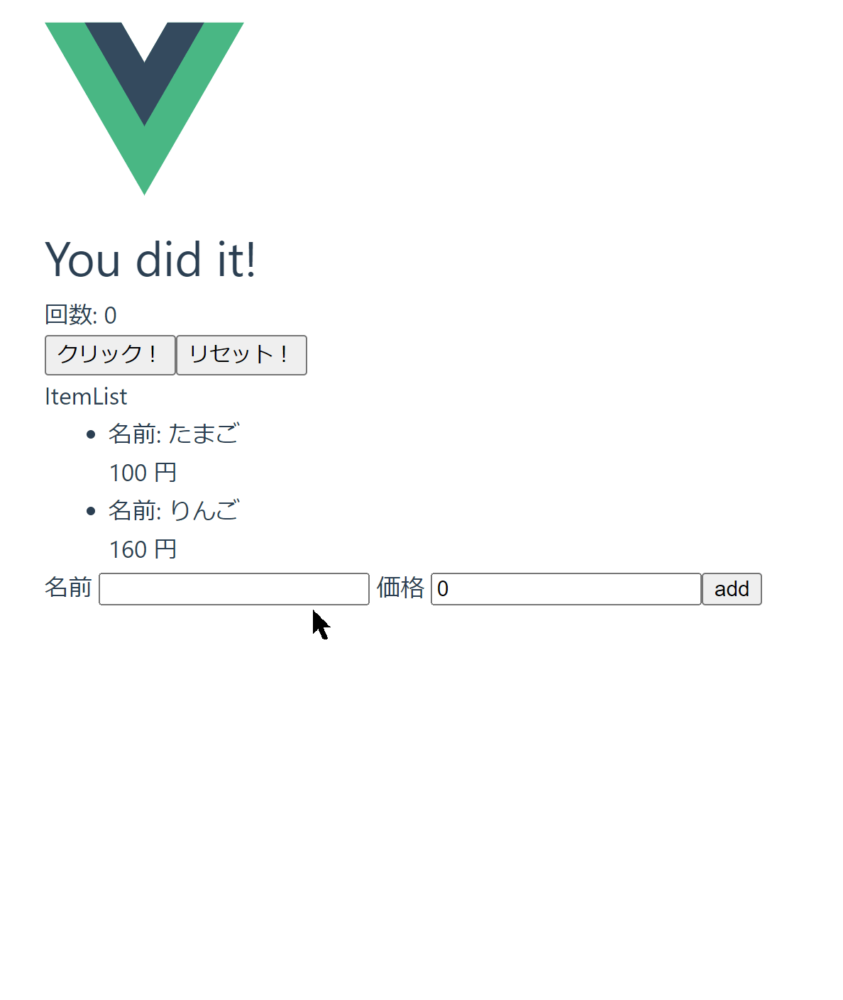
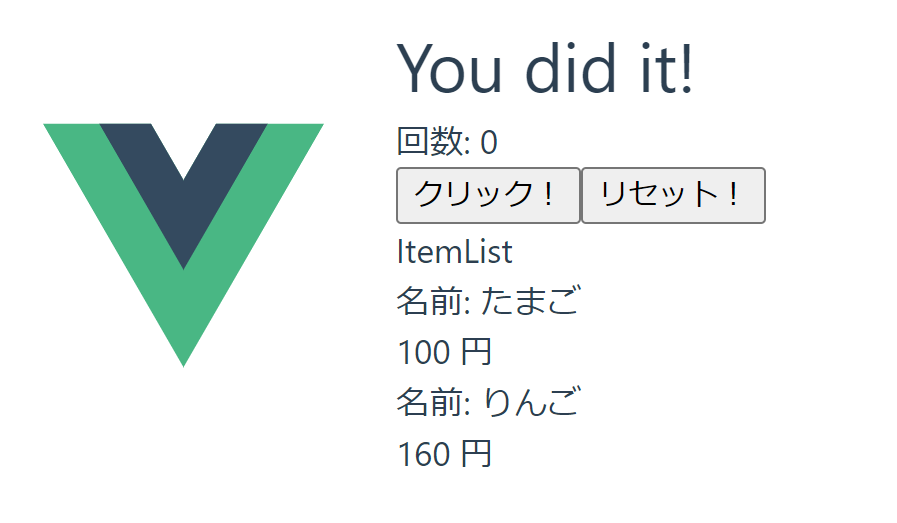

# Vue.js で TodoList(TodoList 編)

## さらに Vue.js を書く

商品リストをテーマに、Todo リストに必要な Vue.js に機能をピックアップしていきます。

こんな感じのを作っていきます。


### 必要な要素を考える

上の Gif のようなアプリを実現するためには何が必要か考えてみましょう。

- 商品リストのコンポーネントを作る
- 商品のリストデータを保存する
- 商品のリストデータを表示する
- 商品を追加できる
- 商品の値段が 500 円以上だったら赤くする
- 商品の値段が 1000 円以上だったら「高額商品」と表示する

こんな感じでしょうか。  
それでは上から順番に実装していきましょう。

### 商品リストのコンポーネントを作る

`components`ディレクトリに`ItemList.vue`というファイルを作成します。


#### src/components/ItemList.vue

中身はコンポーネントに最低限必要な部分だけ書きます。

<<< @/chapter1/section2/2/src/ItemList.vue

#### HelloWorld.vue

<<< @/chapter1/section2/2/src/HelloWorld2.vue

表示されました。
こうすることで、後は`ItemList.vue`の中身を書き変えればよくなります。


### 商品のリストデータを保存する

商品リストのデータを保存するのに適当な変数の型は何でしょうか？  
商品「リスト」なので配列がよさそうです。  
というわけで、配列を使ってデータを保持することにします。  
今は商品の追加ができないので、とりあえずダミーデータを入れておきます。

参考: [Array | MDN](https://developer.mozilla.org/ja/docs/Web/JavaScript/Reference/Global_Objects/Array)  
//todo: オブジェクトのリンクもほしい。

<<< @/chapter1/section2/2/src/ItemList2.vue

4~7 行目は TypeScript の記法で、`Item`という型を`interface`を用いて定義しています。  
そして ref のジェネリクスに`Item[]`を渡すことで、`items`変数を`Item`型の配列の`ref`として扱えるようにしています。

//todo: interface とジェネリクスの参考リンク。

### 商品のリストデータを表示する

先ほど定義したリストの情報を表示していきます。  
Vue.js ではリストデータを`template`タグ内で for 文のように書く `v-for` という構文があります。  
`v-for` を使うときには`:key`を設定しなければいけません(理由(やや難): [優先度 A: 必須 | Vue.js](https://ja.vuejs.org/style-guide/rules-essential.html#use-keyed-v-for))。

参考: [リストレンダリング | Vue.js](https://ja.vuejs.org/guide/essentials/list.html#v-for)

これを使ってデータを表示してみます。

```tsx
<template>
  <div>
    <div>ItemList</div>
    <ul>
      <li v-for="item in items" :key="item.name">
        <div>名前: {{ item.name }}</div>
        <div>{{ item.price }} 円</div>
      </li>
    </ul>
  </div>
</template>
```

表示できました。



### 商品を追加する

Vue.js では入力欄に入力された文字列とコンポーネントの変数を結びつけることができます。  
参考： [フォーム入力バインディング | Vue.js](https://ja.vuejs.org/guide/essentials/forms.html)

これを使って商品を追加できるようにしてみます。

<<< @/chapter1/section2/2/src/ItemList3.vue

参考: [アロー関数式 | MDN](https://developer.mozilla.org/ja/docs/Web/JavaScript/Reference/Functions/Arrow_functions)

できました！


:::info
このままだとボタンを連打して商品の追加ができてしまいます。

- ボタンを押したら入力欄を空にする機能
- 入力欄が空だったらボタンを押しても追加されないようにする機能

を追加してみましょう。
:::

### 商品の値段が 500 円以上だったら赤くする

Vue.js では、ある特定の条件が満たされた時に class を追加するという機構を持たせることできます。  
これを使って、条件が満たされたときだけ CSS を当てるといったことができます。

参考: [CSS の基本 | MDN](https://developer.mozilla.org/ja/docs/Learn/Getting_started_with_the_web/CSS_basics)  
参考: [クラスとスタイルのバインディング | Vue.js](https://ja.vuejs.org/guide/essentials/class-and-style.html#binding-html-classes)

```vue
<template>
	<div>
		<div>ItemList</div>
		<ul>
			<li
				v-for="item in items"
				:key="item.name"
				:class="{ over500: item.price >= 500 }"
			>
				<div>名前: {{ item.name }}</div>
				<div>{{ item.price }} 円</div>
			</li>
		</ul>
		<div>
			<label>
				名前
				<input v-model="newItemName" type="text" />
			</label>
			<label>
				価格
				<input v-model="newItemPrice" type="number" />
			</label>
			<button @click="addItem">add</button>
		</div>
	</div>
</template>

<style>
.over500 {
	color: red;
}
</style>
```


### 商品の値段が 10000 円以上だったら「高額商品」と表示する

Vue.js では、ある特定の条件を満たした場合のみ、対象コンポーネントを表示するという機能を`v-if`という構文を使って実現できます。

参考: [条件付きレンダリング | Vue.js](https://ja.vuejs.org/guide/essentials/conditional.html)

これを使って商品の値段が 10000 円以上だったら「高額商品」と表示するという機能を実現してみましょう。

```vue
<template>
	<div>
		<div>ItemList</div>
		<ul>
			<li
				v-for="item in items"
				:key="item.name"
				:class="{ over500: item.price >= 500 }"
			>
				<div>名前: {{ item.name }}</div>
				<div>{{ item.price }} 円</div>
				<div v-if="item.price >= 10000">高額商品</div>
			</li>
		</ul>
		==略==
	</div>
</template>
```


これで商品リストが完成しました！

## Todo リストを作る

ここまで紹介してきた機能を使うことで Todo リストが作れるはずです。
頑張りましょう！

:::info
Todo リストを作りましょう。

必要な機能は以下の通りです。

- タスクは未完または完了済みの状態を持つ
- タスクはタスク名を持つ
- 未完タスクのリストと完了済みタスクのリストが表示される
- タスクを完了させることができる
- タスクを追加することができる

以上の機能が実現されていれば後は自由です。
スタイルが気になる人は CSS なども書きましょう。
:::
