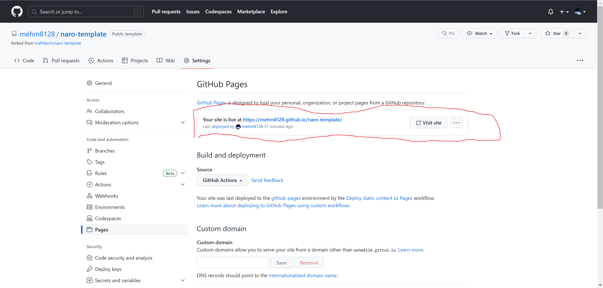

# 制作物を公開してみよう

## ビルドする

`npm run build`でビルドを行うことができます。

Vue などのフレームワークの記法に従って書かれたコードは、そのままではブラウザ上で動きません。  
Vite のようなバンドラーによって、以下のような様々な処理を加えられた後、いい感じにブラウザ上で動作する生の HTML/CSS/JS として出力されます。

- 依存関係の解決
- HTML/CSS/JS への変換
- 圧縮
- etc...

ビルドによる成果物は`dist`ディレクトリの中に生成されています。

## 公開する

それでは公開しましょう！

早速 push して公開したいところですが、`.gitignore`をみてみると`dist`ディレクトリが ignore されていることがわかります。

これは GitHub にはソースコードだけをアップロードし、そのソースコードから再現できるものは極力アップロードしない(Git のパフォーマンスに影響するため)という考えから来ているものです。

`node_modules`も同じような理由で ignore されていることがわかります。

ビルド済みの成果物を直接 GitHub にアップロードして GitHub Pages などで公開してもいいのですが、今回は手元でビルドした成果物は使わない方法で GitHub Pages に公開してみましょう。

### GitHub Pages で公開する

GitHub Pages は GitHub に上げたコードから簡単に Web サイトを公開できる機能です。
リモートリポジトリの main ブランチに最新のコードを push できていることを確認し、以下の設定をします。

1. リポジトリの設定ページに移動
2. 左メニューの「Pages」を選択
3. 「Source」の項目で「GitHub Actions」を選択

次に VSCode に戻り、以下のファイルを編集します。

#### .github/workflows/deploy.yml

ディレクトリとファイルを新規作成して、コピー&ペーストしてください。  
今は内容を理解できなくても問題ありません。気になる人は調べたり、以下のリンクを参考にしてみてください。

参考：[静的サイトのデプロイ | Vite](https://ja.vitejs.dev/guide/static-deploy.html)  
参考：[GitHub Actions のワークフロー構文 - GitHub Docs](https://docs.github.com/ja/actions/using-workflows/workflow-syntax-for-github-actions)

<<< @/chapter1/section2/src/2/deploy.yml

#### vite.config.ts

`base`の項目を追加します。`{リポジトリ名}`の部分は自分のリポジトリ名を入れてください。

<<< @/chapter1/section2/src/2/vite.config.ts

これで設定は終わりです。main ブランチに push したら GitHub Actions が走り、GitHub Pages で公開されるはずです。

GitHub Actions の動作確認は、Actions タブから見ることができます。

GitHub Pages で公開された URL は GitHub Actions の実行が終わり次第、先ほどの Pages ページで表示されています。  
このリンクをクリックすると、自分で作ったものが公開できているはずです！

今回の設定ファイルを入れたものは以下のブランチに入っています。参考にしてみてください。  
[traPtitech/naro-template-frontend at example/todolist](https://github.com/traPtitech/naro-template-frontend/tree/example/todolist)

### まとめ
お疲れさまでした！  
これで Vue に入門して Todo リストを作り、GitHub Pages で公開するところまで一通りの流れを掴むことができました。この流れをしっかり理解し、発展させていくことでフロントエンドは自由に書くことができるようになります。  
今回書いたコードを全てまとめたものを以下に公開してあるので、ソースコードとともに参考にしてみてください。

- サイト：https://traptitech.github.io/naro-template-frontend/
- ソースコード：https://github.com/traPtitech/naro-template-frontend/tree/example/sample
