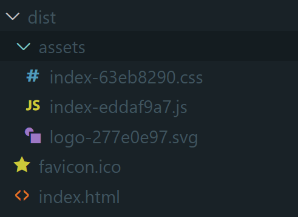
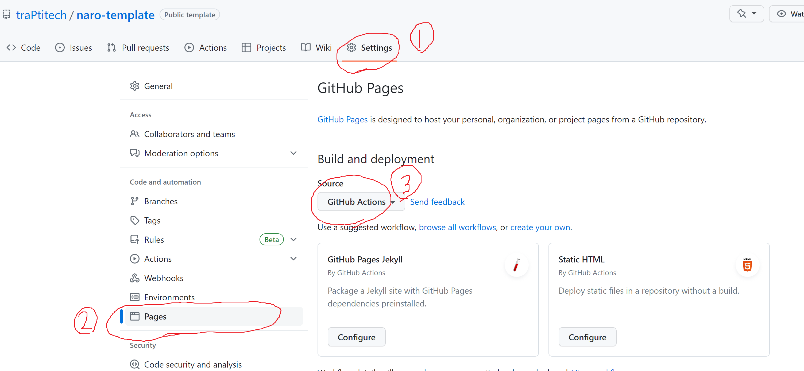

# Vue で TodoList(公開編)

## ビルドする

`npm run build`でビルドを行うことができます。

Vue などのフレームワークの記法に従って書かれたコードは、そのままではブラウザ上で動きません。  
Vite のようなバンドラーによって、

- 依存関係の解決
- HTML/CSS/JS への変換
- 圧縮
- etc...

など様々な処理を加えられた後、いい感じにブラウザ上で動作する生の HTML/CSS/JS として出力されます。

ビルドによる成果物は`dist`ディレクトリの中に生成されています。

## 公開する

それでは公開しましょう！

早速 push して公開したいところですが、`.gitignore`をみてみると`dist`ディレクトリが ignore されていることがわかります。

これは GitHub にはソースコードだけをアップロードし、そのソースコードから再現できるものは極力アップロードしない(Git のパフォーマンスに影響するため)という考えから来ているものです。

`node_modules`も同じような理由で ignore されていることがわかります。

ビルド済みの成果物を直接 GitHub にアップロードして GitHub Pages などで公開してもいいのですが、今回は手元でビルドした成果物は使わない方法で GitHub Pages に公開してみましょう。

### GitHub Pages で公開する

GitHub Pages は GitHub に上げたコードから簡単に Web サイトを公開できる機能です。
リモートリポジトリの main ブランチに最新のコードを push できていることを確認し、以下の設定をします。

1. リポジトリの設定ページに移動
2. 左メニューの「Pages」を選択
3. 「Source」の項目で「GitHub Actions」を選択

次に VSCode に戻り、以下のファイルを編集します。

#### .github/workflows/deploy.yml

ディレクトリとファイルを新規作成して、コピペしてください。  
内容は今は理解できなくても問題ありません。気になる人は調べたり、以下のリンクを参考にしてみてください。

参考：[静的サイトのデプロイ | Vite](https://ja.vitejs.dev/guide/static-deploy.html)  
参考：[GitHub Actions のワークフロー構文 - GitHub Docs](https://docs.github.com/ja/actions/using-workflows/workflow-syntax-for-github-actions)

<<< @/chapter1/section2/src/3/deploy.yml

#### vite.config.ts

`base`の項目を追加します。`<リポジトリ名>`の部分は自分のリポジトリ名を入れてください。  
例：リポジトリ名が TodoList の場合(一部省略)

<<< @/chapter1/section2/src/3/vite.config.ts

<<< @/chapter1/section2/src/3/vite.config.diff

これで設定は終わりです。main ブランチに push したら GitHub Actions が走り、GitHub Pages で公開されるはずです。

GitHub Actions の動作確認は、Actions タブから見ることができます。

GitHub Pages で公開された URL は GitHub Actions の実行が終わり次第、先ほどの Pages ページで表示されています。  
このリンクをクリックすると、自分で作ったものが公開できているはずです！

見本

- サイト：https://trap.jp
- ソースコード：https://github.com/traPtitech

<!-- todo: 作ってリンク貼る-->
