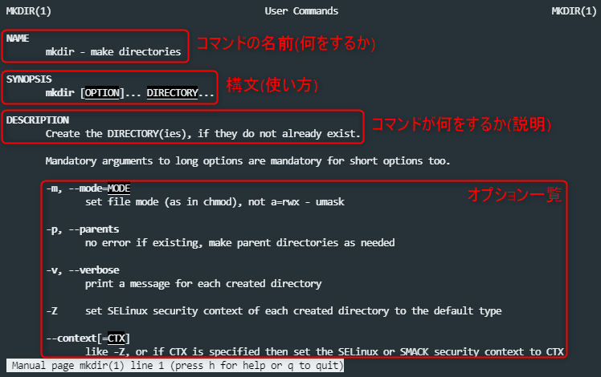
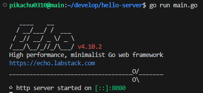
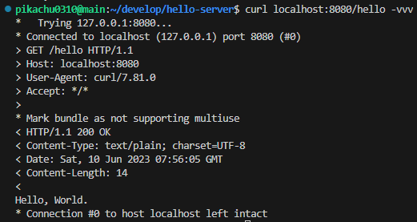
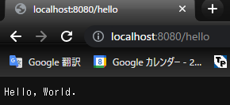

# サーバーアプリケーションを作る

## ファイルの作成

今回は、Go 言語と、Go 言語の有名な web フレームワークである [Echo](https://echo.labstack.com/) を使ってサーバーアプリケーションを作っていきます。

`~/develop/hello-server`というディレクトリを作成し、そのディレクトリを開きます。
```
# ディレクトリ ~/develop/hello-server を作成し、そのディレクトリを開く。

$ mkdir -p ~/develop/hello-server
$ cd ~/develop/hello-server
$ code .
```
:::tip
先ほどのコマンドの`mkdir`は、`make directories`の略で`-p`というオプションを付けると、階層の深いディレクトリを 1 回で作ることができます。このような説明は、man コマンド(マニュアルの man )を使うことで調べることができます。ググる前に使うと良いです。(q キーを押すことで抜けられます。)
```
$ man mkdir
```

:::

:::warning
作ったディレクトリやファイルの名前が違うと、上手く実行できない場合があります。

また、以下に出てくる画像では`~/naro-server/hello-server`となってるのですが、皆さんは`~/develop/hello-server`のはずなので、適宜読み替えてください。
:::

作ったディレクトリの中に`main.go`を作成し、以下のプログラムを書き込みます。

<<<@/chapter1/section3/src/1-1_hello-server.go

Echo は、[Go言語の標準ライブラリ](https://pkg.go.dev/std)に入っていない外部ライブラリなので、外部からインストールしなければなりません。しかし、Go 言語にはそれを自動でやってくれる [Go module](https://go.dev/doc/tutorial/create-module) という便利な機能があるので使ってみましょう。以下を VSCode 内のターミナルで実行してください。(他のターミナルでも可)

:::tip
**ターミナルの開き方**

ツールバー > Terminal > New Terminal でその時開いているディレクトリでターミナルが開きます。
もしくは`Ctrl` + `@`でも。
:::

```
# Go module を初期化して、足りない物をインストールし、使われてない物を削除する。

$ go mod init develop
$ go mod tidy
```

:::warning
本来この develop の所にはリポジトリ名を入れることが多いです。詳しくは[公式ドキュメント](https://go.dev/doc/modules/managing-dependencies#naming_module)を参照してください。
:::

続けて、main.go を実行してサーバーを立てましょう。
```
# 先ほど書いたファイルを実行して、サーバーを立てる

$ go run main.go
```

以下のような画面が出れば起動できています。
止めるときは`ctrl+c`で終了できます。というか止めないと次に起動するときにポート番号を変えないとエラーが出てしまうので使い終わったら止めるようにしましょう。




## アクセスしてみる

まずはコマンドライン(ローカル)でサーバーにアクセスしてみましょう。
コマンドラインでサーバーにアクセスするには、[curl](https://curl.se/)というコマンドを使います。

ターミナルパネルの上にあるツールバーのプラスボタンを押すと、新たにターミナルを開くことができます。


新しくターミナルを開いて、以下のコマンドを実行してみましょう。

```
$ curl localhost:8080/hello
```

すると、レスポンスとして Hello, World が返ってきていることがわかります。


## 更に詳しくリクエストを見る

curl コマンドのオプションとして、リクエストなどの情報を詳しく見る`-vvv`があります。

```
$ curl localhost:8080/hello -vvv
```

とすると


先程座学でやったような、リクエスト・レスポンスが送られていることがわかります。

## ブラウザからアクセスする

localhost は自分自身を表すドメインなので、自分のブラウザからのみアクセスが可能です。
ブラウザで、http://localhost:8080/hello にアクセスしてみましょう。


## 基本問題
エンドポイントとして自分の traQ ID のものを生やして自己紹介を返すようにしてみましょう。

例:


完成したら webApp/jikkyo チャンネルにスクリーンショットを投稿してください。
