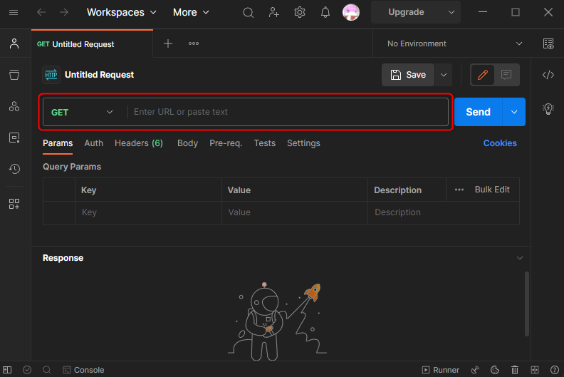
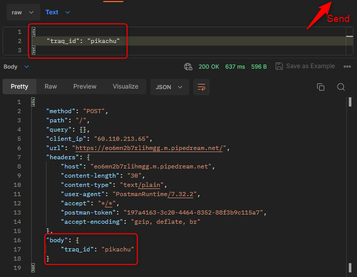
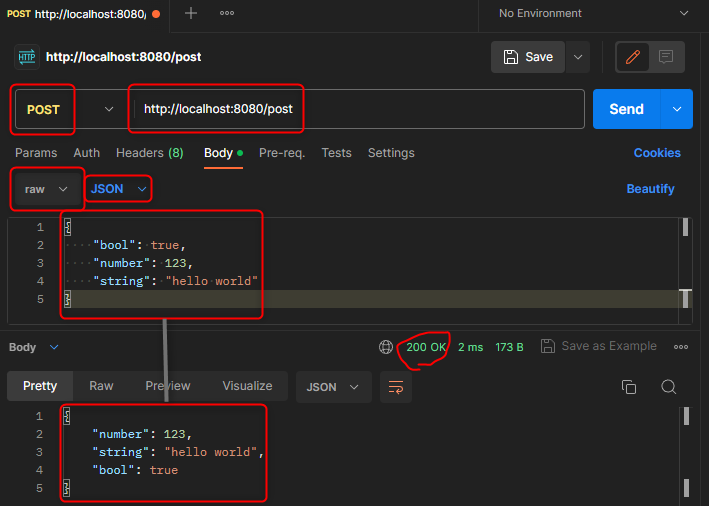

# JSONレスポンスを返してみよう

先ほど作った`main.go`に、レスポンスとして JSON を返すエンドポイントを追加しましょう。
:::tip
JSON について分からない人は
[JSONってなにもの？ | Think IT（シンクイット）](https://thinkit.co.jp/article/70/1)
:::

:::tip
Go の構造体についてわからない人は↓を見ると良いです。

https://go-tour-jp.appspot.com/moretypes/2
:::

JSON をレスポンスとして返すためには、`c.JSON`メソッドに構造体を渡します。  
先ほどの章で作成した`main.go`に、以下のようなエンドポイントを追加して、`JSON`レスポンスを返してみましょう。

<<<@/chapter1/section3/src/2-1_json-server.go

書き換えたら、<a href='http://localhost:8080/json' target="_blank" rel="noopener noreferrer">localhost:8080/json</a> にアクセスして確認してみましょう。


タグを追加することで構造体のフィールドに対応する、JSON のキー名を指定できます。  
Go の構造体のフィールドはパスカルケースですが、JSON のフィールドは普通キャメルケース / スネークケースであるため、`main.go`の構造体を以下のように書き換えましょう。

```go
type jsonData struct {
    // Numner -> number (omitemptyは、ゼロ値の場合はそのフィールドを出力しないという意味)
	Number int    `json:"number,omitempty"`
	String string `json:"string,omitempty"`
	Bool   bool   `json:"bool,omitempty"`
}
```

参考: [encoding/json#Marshal](https://pkg.go.dev/encoding/json#Marshal)

## Postmanでリクエストしてみよう

### Postmanのインストール
[Postman | API Development Environment](https://www.getpostman.com/) は GUI で HTTP リクエストを行えるアプリケーションです。

[ダウンロードページ](https://www.postman.com/downloads/)

Postman 起動したら、workspace を作成して移動し、`Ctrl + N`->`HTTP`または`Overview`タブの横にある`+`を押して、リクエスト設定画面を開きます。



`Enter URL or paste text`とあるところで HTTP method と URL を指定できます。  
Postman を使って、GET リクエストを自分のサーバーに送ってみましょう。
つまり、`HTTP Method`として`GET`を使用して、URL`http://localhost:8080/hello`にリクエストを送信しましょう。

```
HTTP Method: GET

URL: http://localhost:8080/hello
```
以下の画像のように設定してください。


```
Hello, World.
```
と表示されれば成功です。

## 次に POST リクエストを使ってみましょう

POST ではサーバーにデータを送ることができます。

1. Postman で Body タブを選択
2. ラジオボタンの`raw`を選択
3. 右に出てくるプルダウンから`JSON(application/json)`を選択します  
POST で渡せるデータの型は複数あり、上記の操作で JSON を使うということを明示しています。

以下のように自分の traQ ID を POST してみましょう。

```
HTTP method: POST

URL: https://eo6mn2b7rlihmgg.m.pipedream.net
```
```json
{
    "traq_id": "pikachu"
}
```



`traq_id`が`pikachu`の例だと、上の画像のように、以下のような JSON が返ってきます。
```
{
    ...
    "body": {
        "traq_id": "pikachu"
    }
}
```

<!--
inspectある?
から自分のtraQ IDがあるか確認してみましょう
-->

## 自分のサーバーでPOSTを受け取ってみよう

POST で JSON を受け取って、内容をそのまま返すサーバーを作ってみます。  
`e.GET`と同じように、`e.POST`と書くことで POST を受け取ることができます。  
POST のハンドラは、受け取りたい JSON を示す空の変数を先に用意し、`Context`の`Bind`に渡すことで送られてきたデータを取り出すことができます。  
データが存在しなかったりした場合には、返り値の`err`にエラーが入ります。  
逆にエラーがないときは`err`に`nil`が返ってくるので、`if`で条件分岐をします。

<<< @/chapter1/section3/src/2-2_echo-server.go

Postman を使って実際に受け取れている / 送り返せているか確認してみましょう。

:::info
omitempty を指定していると false, 0, 空文字("")は返ってきません。(omitempty は、ゼロ値の場合はそのフィールドを出力しないという意味でしたね。)
:::


