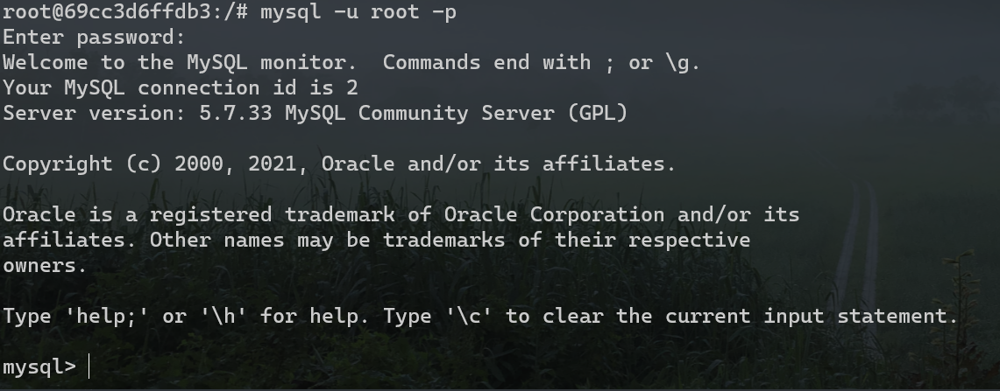

# データベースを扱う準備

## RDBMSのインストール

:::info 注意
今回は、別に準備されたものを使うので、必要ありません。
:::

今回は MariaDB を使います。
データベースのようなパッケージはパッケージ管理ツールからのインストールが一般的です。
OS 標準のパッケージ管理ツールは Linux の種類ごとに違い、今回サーバーとして利用している Ubuntu では `apt` が使われています。

[`apt`についてのページ](https://manpages.ubuntu.com/manpages/xenial/ja/man8/apt.8.html)

ローカルでのインストール方法については各自調べてみてください。

## データベースを立ち上げる

この講習会では、「Docker」と呼ばれるコンテナ型仮想環境に MariaDB を載せて使います。Docker は開発でよく使う便利なものですが、今は理解できなくても大丈夫です。第 0 回でインストールした「Docker Desktop」を立ち上げてください。これ以降もデータベースを使う作業をする際は必ず「Docker Desktop」を立ち上げてください。

「Docker Desktop」を立ち上げたあと、ターミナルで `task up` を実行してください。これによってデータベースが立ち上がります。


次に `task db` を実行しましょう。MariaDB が動いている Docker コンテナの中に入ることができます。


この状態で `mysql -u root -p` と入力するとパスワードを求められます。「`password`」と入力してください。このとき、入力した文字は表示されないので注意してください。下の画像のように `mysql>` と表示されたら成功です。
`mysql -u root`は、「MySQL を`root`というユーザーで使うためにパスワードを使ってログインする」という意味のコマンドです。パスワードをつなげて`mysql -u root -ppassword`ともできます。



:::tip **注意**

これからはさまざまな場所でコマンドを入力することになります。どこで入力すべきか混乱しないようにしましょう。この資料では以下のような表記をします。

- 普通のターミナル（PC から起動して最初に出てくるやつ）

```bash
$ ~~~
```

- Docker のターミナル（`task db`を実行すると出てくるやつ）

```bash
/# ~~~
```

- MySQL でのコマンド（Docker のターミナルで`mysql -u root`をするとでてくるやつ）

```sql
mysql> ~~~
```

打ち間違いを防ぐためにコマンドのコピーをお勧めしますが、右のコピーボタンからコピーする際は、最初の記号も含めてコピーされるので注意してください。

:::

:::info 細かいことを知りたい人向け。

**`task`って何だ。**

task は、Go 言語で動いているタスクランナーです。これによって長いコマンドを短くできたり、複数のコマンドを 1 回で実行できたりと、開発においてとても便利なツールです。テンプレートリポジトリに`Taskfile.yaml`というファイルがありますが、このファイルによってコマンドの設定しています。公式ドキュメントは英語しかありませんが、興味のある人は目を通してみてください。

task 公式ドキュメント https://taskfile.dev/
     GitHub https://github.com/go-task/task

:::
