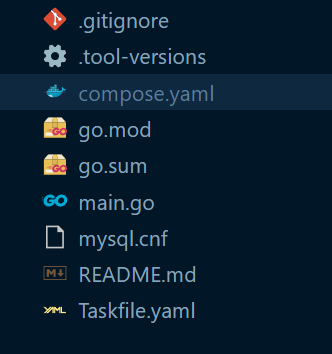

# Goでデータベースを扱う

ここからは Go 言語でデータベースを扱っていきます。`task up`を実行してデータベースが立ち上がっていることを確認してください。
まずは VSCode で先ほどクローンしてきたリポジトリを開きましょう。画像のようなファイルが入っているはずです。 main.go を開いてください。


## データベースに接続する

### Goのプログラムを書く

サンプルのプログラムが書いてありますが、データベースと接続できるように書き換えます。
Go でデータベースに接続するためのライブラリは様々ありますが、今回は SQL 文を書く SQLX を使います。

- 参考
  - [jmoiron/sqlx: a set of extensions on go's standard `database/sql` library.](https://pkg.go.dev/github.com/jmoiron/sqlx)
  - [Illustrated guide to SQLX](https://jmoiron.github.io/sqlx/)

<<< @/chapter1/section4/src/connect_db.go

書き換えた後、 import の周りで赤字のエラーが出た場合は、ターミナルで`go mod tidy`を実行してください。
24,25 行目の`dsn`という変数でデータベースに接続するための設定をして、26 行目の`db, err := sqlx.Open("mysql", dsn)`でデータベースに接続しています。25 行目で`os.Getenv()`という関数が出てきていますが、これは環境変数と呼ばれる、コンピューター側で設定してプログラムで使えるようにしている変数です。今は必要なデータベースのパスワードなどの環境変数を何も設定していないので、設定します。

### 環境変数を設定する

`env.sh`というファイルを作り、以下の内容を書いてください。

```sh
export DB_USERNAME="root"
export DB_PASSWORD="password"
export DB_HOSTNAME="localhost"
export DB_PORT="3306"
export DB_DATABASE="world"
```

今回は手元で動いているデータベースを使うのでパスワードなどが知られても問題ありませんが、実際には環境変数など外部の人に知られたくない、GitHub などに上げたくないファイルもあります。そのような場合は、`.gitignore`というファイルを使うことで特定のファイルやフォルダを Git 管理の対象外にできます。`.gitignore`ファイルの最後に`env.sh`を追記しましょう。

```txt
...
# Go workspace file
go.work

.tool-versions
env.sh // [!code ++]
```

最後に環境変数ファイル`env.sh`を環境変数として読み込むために、ターミナルで`source env.sh`を実行してください。

:::warning

```sh
$ source env.sh
```

このコマンドによって読み込んだ環境変数は、コマンドを入力したターミナルを終了すると消えてしまいます。また、コマンドを入力したターミナル以外では環境変数として読み込まれません。新しくターミナルを開きなおした場合などは、もう一度実行してください。
:::

### 実行する

```sh
$ go run main.go
```

出力はこのようになります。

```txt
conntected
Tokyoの人口は7980230人です
```

`main.go`を解説してきます。

<<< @/chapter1/section4/src/connect_db.go#city

この`City`構造体の横にあるバッククオートで囲まれたタグに`db`でデータベースのカラム名を指定します。これによってライブラリがデータベースから取得したレコードを構造体に上手くあてはめてくれます。

参考: [Struct タグについて | text.Baldanders.info](https://text.baldanders.info/golang/struct-tag/)

<<< @/chapter1/section4/src/connect_db.go#get

`City`型の`city`という変数のポインタを sqlx ライブラリの`Get`関数の第 1 引数に指定します。第 2 引数には SQL 文を書きます。`Name = ?`としていますが、第 3 引数以降の値が順番に`?`へと当てはめられて SQL 文が実行され、取得したレコードが`city`変数に代入されます。

### 基本問題

```sh
$ go run main.go {都市の名前}
```

と入力して、同様に人口を表示するようにしましょう。

ヒント：[Go言語 - os.Argsでコマンドラインパラメータを受け取る - 覚えたら書く](https://blog.y-yuki.net/entry/2017/04/30/000000)

:::details 答え
<<< @/chapter1/section4/src/practice_basic1.go
:::

### 応用問題

基本問題 1 と同様に都市を入力したとき、その都市の人口がその国の人口の何％かを表示してみましょう。

ヒント： 1 回のクエリでも取得できますが、2 回に分けた方が楽に考えられます。

:::details 答え
<<< @/chapter1/section4/src/practice_advanced.go
:::

## 複数レコードを取得する

`Get`関数の代わりに`Select`関数を使い、第 1 引数を配列のポインタに変えると、複数レコードを取得できます。`main.go`の`main`関数を以下のように書き換えて実行してみましょう。

<<< @/chapter1/section4/src/select.go#main
以下のように日本の都市一覧を取得できます。

```txt
conntected
日本の都市一覧
都市名: Tokyo, 人口: 7980230
都市名: Jokohama [Yokohama], 人口: 3339594
都市名: Osaka, 人口: 2595674
都市名: Nagoya, 人口: 2154376
都市名: Sapporo, 人口: 1790886
都市名: Kioto, 人口: 1461974
...省略
```

## レコードを書き換える

`INSERT`や`UPDATE`、`DELETE`を実行したい場合は、`Exec`関数を使うことができます。第 1 引数に SQL 文を渡し、第 2 引数以降は`?`に当てはめたい値を入れます。

```go
result, err := db.Exec("INSERT INTO city (Name, CountryCode, District, Population) VALUES (?,?,?,?)", name, countryCode, district, population)
```

例えば`INSERT`ならば、このように使うことができます。`result`には操作によって変更があったレコード数などの情報が入っています。
