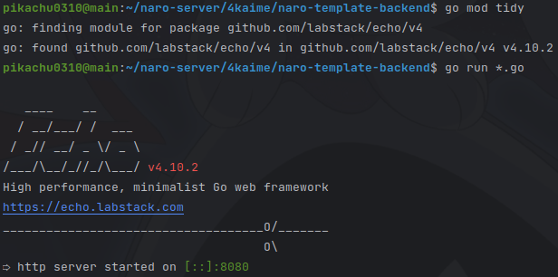

# サーバーのログイン機能の実装

## プロジェクトのセットアップ

### 環境準備

今回の演習は、[(第一部)サーバーからデータベースを扱う](../../chapter1/section4/4_server_and_db) の状態から開始します。

もしファイルを削除してしまった場合は、以下の手順でセットアップしましょう。

1. [データベースを扱う準備](../../chapter1/section4/0_prepare) からプロジェクトをセットアップしましょう。

2. `.env` ファイルを作成し、以下のように編集しましょう。

```sh
export DB_USERNAME="root"
export DB_PASSWORD="password"
export DB_HOSTNAME="localhost"
export DB_PORT="3306"
export DB_DATABASE="world"
```

3. `source .env` を実行しましょう。

4. `go mod tidy` を実行しましょう。

以上でセットアップはできているはずです。

### ファイルの分割

このまま演習を初めてしまうとファイルが長くなりすぎてしまうので、ファイルを分割します。
各エンドポイントでの処理はハンドラーと呼ばれますが、それを `handler.go` に移動してみましょう。

### main.go の設定

main.go を以下のように編集しましょう。

<<<@/chapter2/section1/src/0/main.go{go:line-numbers}

ファイルを編集したら、`go mod tidy` を実行しましょう。

### handler.go の設定

1. 同じディレクトリに新しく `handler.go` というファイルを作成する
2. `handler.go` を以下のように記述する

<<<@/chapter2/section1/src/0/handler.go{go:line-numbers}

ファイルを編集したら、`go mod tidy` を実行しましょう。

### 準備完了

今回は `main.go` 以外に `handler.go` も存在するので、どちらも指定して `go run *.go` を実行しましょう。



無事起動が確認できたら、 `Ctrl+C` で一旦止めましょう。

## この章の目的

`main.go` の handler の設定部分を見てみましょう。

<<<@/chapter2/section1/src/0/main_handler.go#handler{go:line-numbers}

今回の目標は、 `/cities/` で始まる api (getCityInfoHandler, postCityHandler) 2 つに対して、
ログインしているかどうかを判定して、ログインしていなければリクエストを拒否するように実装することです。

用語を使わずに言えば、`City` を新たに追加したり、`City` の情報を得るのにログインを必須にする、ということです。

実装は以下のように進めます。

1. アカウントを作成できるようにする
2. ログインを実装する
3. ログインしないと利用できないようにする

## ライブラリのインストール

新たにライブラリを導入するので以下のコマンドを実行します。

```sh
go get -u github.com/labstack/echo-contrib/session
go get -u github.com/srinathgs/mysqlstore
```

## アカウント作成の実装

アカウントの作成を実装します。

アカウントの作成では、以下のことを行います。

1. クライアントから`Username`と`Password`をリクエストとして受け取る
2. `Username`と`Password`のバリデーション(値が正当かのチェック)を行う
3. `Password`をハッシュ化する
4. 既に同じ`Username`のユーザーが登録されていないかチェックする
5. ユーザーをデーターベースに登録する

それでは、上記を実装していきましょう。

まず、`main.go`の`var`の箇所に、 `salt` を追加します。

<<<@/chapter2/section1/src/0/main_handler.go#var{go:line-numbers}

ここで新しく定義した`salt`という変数は、パスワード等をハッシュ値へと変換する際に、パスワード等の末尾に付与するランダムな文字列のことです。

全員が同じハッシュ処理を使用していたとすると、他のサービスで保存されているハッシュされたパスワードと自分のサービスで保存されるものが一致したときにパスワードが特定できてしまいます（レインボーテーブル攻撃）。

このような処理をすることで、それらの可能性を防ぐことができます。

`salt` は他と一致しない独自の文字列にする必要があります。環境変数に隠しているので、環境変数を更新しましょう。

ハッシュ値は 32 バイト, 64 バイト, 128 バイトにする事が推奨されているようです。

<<<@/chapter2/section1/src/0/.env{go:line-numbers}

更に、アカウントを管理するテーブル `users` を作成します。

<<<@/chapter2/section1/src/0/handlers.go#setup_table{go:line-numbers}

続いて、アカウントを作成するハンドラーである `signUpHandler` を `handler.go` に実装していきましょう。

```go
func signUpHandler(c echo.Context) error {
}
```

この `signUpHandler` に以下のものを順番に実装していきます。最悪コピペでも動くはず。

<<<@/chapter2/section1/src/0/final/code.go#request{go:line-numbers}

まず初めに、 req 変数にrequestBody の json 情報を格納します。`LoginRequestBody` 型を見れば分かる通り、ここには UserName と
Password が格納されています。

<<<@/chapter2/section1/src/0/final/code.go#valid{go:line-numbers}

ここでは、UserName と Password が正しく入っているのかをチェック（バリデーションといいます）します。
入っていない場合は、与えられた入力が正しくない間違った形式なので、 400 (Bad Request) をレスポンスします。

<<<@/chapter2/section1/src/0/final/code.go#check_user{go:line-numbers}

`"SELECT COUNT(*) FROM users WHERE Username=?", req.Username` で、指定された UserName を持つユーザーの数を見ます。

結果は `count` 変数に格納されます。

もしすでに居た場合は、そのユーザーが存在しているので処理は受け付けず、 409 (Conflict) をレスポンスします。

ここまでは「リクエストを実行しても本当に問題がないか」を検証していました。
ユーザーはまだ存在していなくて、パスワードとユーザー名がある事まで確認できれば、リクエストを処理できます。のでここから処理を行っていきます。

<<<@/chapter2/section1/src/0/final/code.go#hash{go:line-numbers}

まずはパスワードのハッシュ化です。 **パスワードは平文で保存してはいけません！** パスワードを DB に保管するときは、必ずハッシュ化をしましょう。
ソルトはさっき説明しました。

`bcrypt`というのはいい感じにハッシュ化してくれるライブラリです。セキュリティに関わるものは自分で実装すると穴だらけになりやすいので、積極的にライブラリに頼りましょう。

<<<@/chapter2/section1/src/0/final/code.go#add_user{go:line-numbers}

Username,HashedPassword を持つ User レコードをデータベースに追加しましょう。

何かしらのエラーによって生成できなかった場合は err にその内容が詰め込まれます。
ユーザーのリクエストは問題なく、ここでエラーが発生した場合はサーバー側で何かが発生したということなので、
500 (InternalServer Error) をレスポンスします。

ここで、どんなエラーが発生したかをユーザーに直接伝えるのはセキュリティの観点から △ です。
ログで出力するだけにして、ユーザー側には 500 という情報だけ渡しましょう。

もし err がなければ、それはうまく成功したということです。 201 (Created) をレスポンスしましょう！

これで実装は終わりです。すべてを実装すると以下のようになります。

<<<@/chapter2/section1/src/0/signUpHandler.go{go:line-numbers}

最後に、`main.go` に、先ほど書いたハンドラーを追加しましょう。

<<<@/chapter2/section1/src/0/handlers.go#signup{go:line-numbers}

:::warning
このコードは後々の回で使用するので、エンドポイント (`/signup` など) は変更しないでください！

エンドポイントの追加は問題ないので、試したい場合は新しくハンドラーを実装しましょう。
:::

ここまでできたら、実行して、PostMan 等を用いて正しく実装できているかデバッグしてみましょう。

正しく API を叩いたあとに、テーブルに 意図したユーザー名と、ハッシュ化されたパスワードが入っていますか？

:::details 確認に使う SQL クエリ

```sql
USE
world;
SELECT *
FROM users;
```

:::

## セッション管理機構の実装

<<<@/chapter2/section1/src/0/final/code.go#setup_session{go:line-numbers}

セッションストアを設定しましょう。
セッションとは、今来た人が次来たとき、同じ人であることを確認するための仕組みです。

ここでは、そのセッションの情報を記憶するための場所をデータベース上に設定しています。

この仕組みを使用するために、 `e.Use(session.Middleware(store))` を含めてセッションストアを使ってね〜、って echo に命令しています。

`e.Use(middleware.Logger())` は文字通りログを取るものです。ついでに入れましょう。

### loginHandler の実装

```go
func signUpHandler(c echo.Context) error {
}
```

つづいて `loginHandler` を実装していきます。これも `handler.go` に実装しましょう。

<<<@/chapter2/section1/src/0/final/code.go#post_req{go:line-numbers}

req への代入は signUpHandler と同じです。UserName と Password が入っているかも確認しましょう。

パスワードの一致チェックをするために、データベースからユーザーを取得してきましょう。

ユーザーが存在しなかった場合は `sql.ErrNoRows` というエラーが返ってきます。
もしそのエラーなら 401 (UnAuthorized)、そうでなければ 500 (Internal Server Error) です。
もし 404 (Not Found) とすると、「このユーザーはパスワードが違うのではなく存在しないんだ」という事がわかってしまい（このユーザーは存在していてパスワードは違う事も分かります）、セキュリティ上のリスクに繋がります。

ここで、エラーチェックは `==` を使ってはいけません。 `errors.Is` を使いましょう。

<<<@/chapter2/section1/src/0/final/code.go#post_hash{go:line-numbers}

データベースに保存されているパスワードはハッシュ化されています。

ハッシュ化は不可逆な処理なので、ハッシュ化されたものから原文を調べることはできません。確認する際はもらったパスワードをハッシュする事で行います。

これは `bcrypt.CompareHashAndPassword` が行ってくれるのでそれに乗っかりましょう。

- この関数はハッシュが一致すれば返り値が `nil` となります。
- 一致しない場合、 `bcrypt.ErrMismatchedHashAndPassword` が帰ってきます。
- 処理中にこれ以外の問題が発生した場合は、返り値はエラー型の何かです。

従って、これらのエラーの内容に応じて、 500 (Internal Server Erorr) 401 (UnAuthorized) を返却するか、処理を続行するかを選択していきます。

<<<@/chapter2/section1/src/0/final/code.go#add_session{go:line-numbers}

セッションに登録します。セッションについては今回は深掘りしません。
セッションの `userName` という値にそのユーザーの名前を格納していることは覚えておきましょう。

ここまで書いたら、 `loginHandler` を使えるようにしましょう。

```go
e.POST("/login", loginHandler) // [!code ++]
e.POST("/signup", signUpHandler)
```

### userAuthMiddleware

続いて、userAuthMiddleware を実装します。
まず、これは Handler ではなく middleware と呼ばれます。

来るリクエストは、Middleware を経由して、 Handler に流れていきます。

Middleware から次の Middleware/Handler を呼び出す際は `next(c)` と記述します。 Middleware の実装は難しいので、なんとなく理解できれば十分です。

<<<@/chapter2/section1/src/0/final/code.go#userAuthMiddleware{go:line-numbers}

関数が関数を呼び出していて混乱しそうですが、2行目から13行目が本質で、外側はおまじないと考えて良いです。

このミドルウェアはリクエストを送ったユーザーがログインしているのかをチェックし、

ログインしているなら Context (`c`) にそのユーザーの UserName を設定します。

session を取得し、ログイン時に設定した `userName` の値を確認しに行きます。

ここで名前が入っていればリクエストの送信者はログイン済みで、そうでなければログインをしていないことが分かります。

これを利用して、ログインしていない場合には処理をここで止めて 401 (UnAuthorized) を返却し、していれば次の処理 (`next(c)`)
に進みます。

最後に、middlerware を設定しましょう。
グループ機能を利用して、 `withAuth` に設定されてるエンドポイントは `userAuthMiddleware` を処理してから処理する、という設定をします。

```go
e.GET("/cities/:cityName", getCityInfoHandler) // [!code --]
e.POST("/cities", postCityHandler) // [!code --]
withAuth := e.Group("") // [!code ++]
withAuth.Use(userAuthMiddleware) // [!code ++]
withAuth.GET("/cities/:cityName", getCityInfoHandler) // [!code ++]
withAuth.POST("/cities", postCityHandler) // [!code ++]
```

これで、この章の目標である「ログインしないと利用できないようにする」が達成されました。

### getWhoAmIHandler

最後に、 `getWhoAmIHandler` を実装します。叩いたときに自分の情報が返ってくるエンドポイントです。

<<<@/chapter2/section1/src/0/final/code.go#whoami{go:line-numbers}

セッションからアクセスしているユーザーの`userName`を取得して返しています。
`userAuthMiddleware` を実行したあとなので、`c.Get("userName").(string)` によって userName を取得できます。

`withAuth.GET("/whoami", getWhoAmIHandler)` を忘れずに追加しましょう。

## 完成形

<details>

main.go 

<<<@/chapter2/section1/src/0/final/main.go{go:line-numbers}

handler.go

<<<@/chapter2/section1/src/0/final/handler.go{go:line-numbers}


</details>

## 検証

:::warning
全て Postman での検証です
`go run main.go`でサーバーを起動した状態で行ってください
:::

<http://localhost:8080/cities/Tokyo> へ
初めに普通にアクセスするとダメです


ユーザーを作成します。
上手く作成できれば Status 201 が返ってくるはずです。


そのままパスを変えてログインリクエストを送ります。


ログインに成功したら、レスポンスの方の Cookies を開いて value の中身をコピーします


リクエストの方の Headers で Cookie をセットします。

Key に`Cookie`を
Value に`sessions=(コピーした値);`をセットします(既に自動で入っている場合もあります、その場合は追加しなくて大丈夫です)。

もう一度 <http://localhost:8080/cities/Tokyo> にアクセスすると正常に API が取れるようになりました。


ここで、作成されたユーザーがデータベースに保存されていることを確認してみましょう。
`mysql > SELECT * FROM users;`

ユーザー名とハッシュ化されたパスワードが確認できますね。

ちょっと分かりにくい表示ですが、セッションもしっかり確認できます。

# 難

TODO リストのサーバーとしての API を考えて作ってみましょう。

:::tip
ここまでで Web サービスを作るコードの知識として必要な要素は全て網羅したつもりです。
みなさんはもう何でも作れるわけです!!!!

今回の目標は Twitter クローンの作成なので、早速作り始めても OK です!!
<!-- リポジトリ名変える -->
もし作り始める場合は <https://github.com/tohutohu/naro-portal> から fork して作業をして、Pull Request を出してもらえると講師や
TA やその他暇な人が勝手にレビューをします！ 全部完成していなくてもここまでできたので見てくださいとかでも構いません！
ぜひ皆さん使ってください！

fork とか Pull Request とかがわからない人は TA に言ってください(3 分くらいで終わるので)
:::
