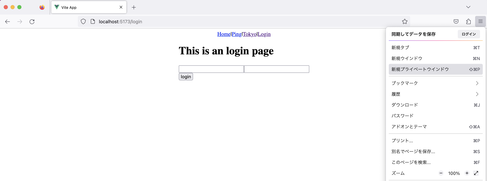
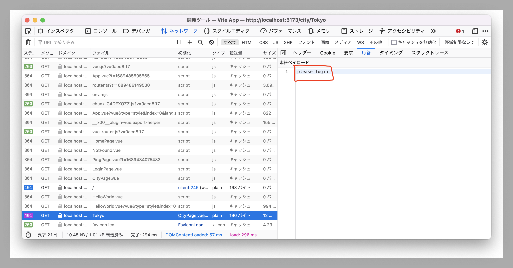

# サーバーとの通信

## pingページの作成

接続の練習のためサーバーに`/ping`エンドポイントを実装しておきましょう。
サーバーのリポジトリの`main.go`の`main`関数を書き換えます。

<<<@/chapter2/section2/src/2/main.go{go:line-numbers}

次にフロントエンドから`/ping`エンドポイントにアクセスしてみるコードを書いてみましょう。

`src/page`以下に`PingPage.vue`を作ってみましょう。

<<<@/chapter2/section2/src/2/PingPage.vue{vue:line-numbers}

`onMounted`の引数として渡された関数は、コンポーネントが描画されたときに実行されます。今回はサーバーの`/ping`エンドポイントにアクセスしてそのデータを`pong`という変数に代入しています。

関数の定義の前に`async`とついているのは、この関数は非同期に実行するということを宣言しています。非同期に実行するというのは、この関数の処理が終わる前に次の式を評価できるという理解で良いでしょう。サーバーとの通信処理は長時間かかることがあり、待機時間も長いので他の処理ができないと非効率であるために非同期処理となっています。

また、関数実行の前に`await`とついているのはこの関数の処理が終わるまで次の処理を待つということを表しています。これをやらないと処理が終わる前に次の処理に進んでしまうことがあります。

7 行目で変数`res`にサーバーからのレスポンスを格納しています。
8 行目で http ステータスが ok であるかを確認して、 9 行目でレスポンスの中身をテキストとして取得しています。

`router.ts`に`PingPage`を追加するのも忘れず行いましょう。

<<<@/chapter2/section2/src/2/router.ts{typescript:line-numbers}

`http://localhost:5173/ping`にアクセスすると以下のような画面が表示されれば OK です。

参考: 
[Composition API: ライフサイクルフック | Vue.js](https://ja.vuejs.org/api/composition-api-lifecycle.html#onmounted) 
[フェッチAPI - Web API | MDN](https://developer.mozilla.org/ja/docs/Web/API/Fetch_API) 
[非同期 JavaScript 入門 - ウェブ開発を学ぶ | MDN](https://developer.mozilla.org/ja/docs/Learn/JavaScript/Asynchronous/Introducing) 
[async function - JavaScript | MDN](https://developer.mozilla.org/ja/docs/Web/JavaScript/Reference/Statements/async_function)

## ログインページの作成

ログインページを作成してみましょう！
上と同じようにページを分けて進めていきましょう。

- ユーザー名とパスワードが入力できる
	- input タグを使いましょう
	- v-model とかをうまく使いましょう
		- [v-model | Vue.js](https://v3.vuejs.org/guide/migration/v-model.html)
- ログインボタンを押すと`/api/login`に POST する
	- POST の JSON はサーバーのコードに合わせて書きましょう
  
`fetch`でサーバーに対して`POST`リクエストを送りたい場合は次のようにやれば良いでしょう。
  
<<<@/chapter2/section2/src/2/fetch_post_option.ts{typescript:line-numbers}

:::details 解答

#### src/pages/LoginPage.vue

新規作成するファイルです。

<<<@/chapter2/section2/src/2/LoginPage.vue{vue:line-numbers}

#### src/App.vue

template 部分のみ。

<<<@/chapter2/section2/src/2/App_2.vue{vue:line-numbers}

#### src/router.ts

<<<@/chapter2/section2/src/2/router_2.ts{typescript:line-numbers}

:::

## ログイン済みページの作成

前回作った都市の情報を返す API を表示するページを作成します。

#### src/pages/CityPage.vue

新規に作成するファイルです。
`res.json()`としている部分では、サーバーからのレスポンスを json として解釈して JavaScript のオブジェクトに変換しています。

<<<@/chapter2/section2/src/2/CityPage.vue{vue:line-numbers}

#### src/router.ts

`CityPage.vue`を読み込み登録します。
echo と同じように、`path`に`:`始まりで書くと、PathParameter として値を取得できます。

参考: [Dynamic Route Marching | Vue Router](https://next.router.vuejs.org/guide/essentials/dynamic-matching.html)

<<<@/chapter2/section2/src/2/router_3.ts{typescript:line-numbers}

#### src/App.vue

リンクを追加します。

<<<@/chapter2/section2/src/2/App_3.vue{vue:line-numbers}

### 確認

完成するとこんな感じ。

### 発展課題
HomePage.vue に任意の都市について表示できるような仕組みを作ってみましょう。
- input タグで都市名を指定
- 「表示する」のようなボタンを押すことで`/city/{その都市名}`というリンクに飛ばす

参考: [Programmatic Navigation | Vue Router](https://next.router.vuejs.org/guide/essentials/navigation.html)

## ログインしていない場合に、ログインページに遷移させる

ブラウザのシークレットウィンドウを起動し、先程の`/city/Tokyo`を開いてみます。

本来は上のスクリーンショットのように東京の情報が表示されてほしいですが、表示されません。

ブラウザの開発者ツールから見てみるとログインしていないため、ダメだということがわかりました。

そこで、ログインしていない場合にはログインページにリダイレクトするように変更してみます。

### whoamiエンドポイントの作成

上のように何らかのエンドポイントを叩いた結果、401 が返ってきたらリダイレクトするようにしてもいいですが、今回は traQ やその他 traP のアプリケーションでの書き方に習って、`whoami`のエンドポイントを使ってログインされているかの確認をします。

このエンドポイントはログインしているユーザー自身の情報を取得するエンドポイントです。なぜこんなエンドポイントが必要かというと、クライアント自身は自分が何というユーザーでログインしているかをサーバーに問い合わせることなく知ることができないからです。
traQ でも一番始めに `whoami` と同じ働きをするエンドポイントを叩き自分の情報を取得しています。

### router.tsでログインの確認を行う

Vue Router の`beforeEach`という機能を使って、各 Routing の前に特定の関数を呼び出すことができます。
このようにログイン状態を確認する方法はパターンとして覚えてしまってもいいでしょう。

`beforeEach`に関して詳しくは: [Navigation Guards | Vue Router](https://next.router.vuejs.org/guide/advanced/navigation-guards.html)

#### src/router.ts

<<<@/chapter2/section2/src/2/router_4.ts{typescript:line-numbers}

これでログインしていない場合には、`/login`へリダイレクトされるようになりました。
しかし、`/login`以外の全てのページへアクセスできません(シークレットウィンドウなどで開いて確認してみましょう)。

### 特定のページだけログイン不要にする

素朴な実装としては、`beforeEach`の中の条件分岐を増やして許可するという方法が思いつきますが、同じような処理を何度も書くのは面倒ですし、読みにくくなります。
ここでは、Vue Router の `meta` という機能を使って Route にメタ情報を付与し、それを用いてログイン不要かどうかを判断します。

参考: [Route Meta Field | Vue Router](https://next.router.vuejs.org/guide/advanced/meta.html)

#### ルーティング設定にmetaを追加

ログインしていなくてもアクセスしたいページには`meta: { isPublic: true }`というプロパティを追加します。

#### リダイレクト設定の変更

`if (to.path === '/login')`で分岐していたところを`if (to.meta.isPublic)`に置き換えます。
最終的なコードは以下のようになるはずです。

#### router.ts

<<<@/chapter2/section2/src/2/router_5.ts{typescript:line-numbers}

クライアントの見本：https://github.com/traPtitech/naro-template-frontend/tree/city

サーバー・クライアント両方で API を利用できるようになりました
これからは必要な API を考え、実装していくことになります。

## 最重要課題

 国一覧を表示するページを作り、その国名をクリックすると、その国の都市一覧が表示され、その都市名をクリックすると都市の情報が表示されるようにしてみましょう。

### 発展課題
ログアウト機能を作りましょう。
#### ヒント
* サーバープログラムに`/logout`を作る
* API を叩いた人のセッションをセッションストアから破棄する
* クライアントプログラムに`/logout`の API を叩くボタン作る
