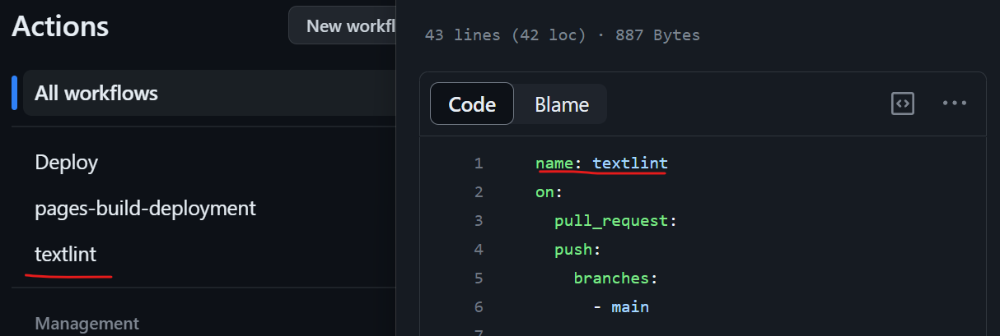

# 自動でテストを実行してみよう

先ほど、関数に対してテストを作成しました。しかし、テストを毎回手動で実行したり、他人に対して実行したか確認したりするのは大変です。

そのため、テストの実行は自動化される必要があります。

今回は Github の機能の 1 つである Actions を使って、テストを自動化してみましょう。

## Github Actionについて

Github Actions は Github が提供している自動化サービスです。  
Pull request が作成されたときや、main ブランチにマージされたときなど、様々なタイミングで自動的に処理を実行できます。

## Github Actionsの設定

Github Actions でいつ、どのような処理を実行するかは、`.github/workflows`ディレクトリに YAML ファイルを作成することで設定できます。

Github Actions で利用する YAML ファイルの構造は、以下のドキュメントに記されています。
https://docs.github.com/en/actions/using-workflows/workflow-syntax-for-github-actions

今回は、`ci.yaml`というファイルを作成し、以下のように記述します。

```yaml
name: CI
on: 
  push: 
    branches:
      - main
  pull_request:

jobs:
  test:
    name: Test
    runs-on: ubuntu-latest
    steps:
      - uses: actions/checkout@v3
      - uses: actions/setup-go@v4
        with:
          go-version: 1.20
      - name: Run tests
        run: go test ./...
```

以下、このファイルについて解説していきます。

## `name`

```yaml
name: CI // [!code focus]
on: 
  push: 
    branches:
      - main
  pull_request:

jobs:
  test:
    name: Test
    runs-on: ubuntu-latest
    steps:
      - uses: actions/checkout@v3
      - uses: actions/setup-go@v4
        with:
          go-version: 1.20
      - name: Run tests
        run: go test ./...
```

`name`は、この Github Actions の名前です。
ここに設定された名前が、実行時のログに表示されます。



## `on`

```yaml
name: CI
on: // [!code focus:5]
  push: 
    branches:
      - main
  pull_request:
jobs:
  test:
    name: Test
    runs-on: ubuntu-latest
    steps:
      - uses: actions/checkout@v3
      - uses: actions/setup-go@v4
        with:
          go-version: 1.20
      - name: Run tests
        run: go test ./...
```

`on`は、この Github Actions が実行されるタイミングを設定します。
今回の場合は、「`main` ブランチに push されたとき」と「Pull request が作成・更新されたとき」に実行されます。

## `jobs`

```yaml
on:
  push: 
    branches:
      - main
  pull_request:
jobs: // [!code focus:11]
  test:
    name: Test
    runs-on: ubuntu-latest
    steps:
      - uses: actions/checkout@v3
      - uses: actions/setup-go@v4
        with:
          go-version: 1.20
      - name: Run tests
        run: go test ./...
```

`jobs`は、この Github Actions で実行する処理を設定します。

その中身について見ていきましょう。

### `runs-on`

```yaml
on:
  push: 
    branches:
      - main
  pull_request:
jobs:
  test:
    name: Test
    runs-on: ubuntu-latest  // [!code focus]
    steps:
      - uses: actions/checkout@v3
      - uses: actions/setup-go@v4
        with:
          go-version: 1.20
      - name: Run tests
        run: go test ./...
```

`runs-on`は、この Github Actions を実行する環境を設定します。今回は Ubuntu の最新バージョンを指定しています。

これ以外にも、Windows Server や macOS など、様々な環境の指定ができます。

参考：https://docs.github.com/en/actions/using-workflows/workflow-syntax-for-github-actions#jobsjob_idruns-on


### `steps`

```yaml
on:
  push: 
    branches:
      - main
  pull_request:
jobs:
  test:
    name: Test
    runs-on: ubuntu-latest
    steps: // [!code focus:10]
      - uses: actions/checkout@v3
      - uses: actions/setup-go@v4
        with:
          go-version: 1.20
      - name: Run tests
        run: go test ./...
```

`steps`は、この Github Actions で実際に実行する処理を順番に記述していくところです。

#### `uses`

`uses`は、Github Actions で提供されているを利用するための設定です。

例えば、`actions/checkout@v3`は、リポジトリをクローンし、指定したブランチに移動するモジュールです。
デフォルトでは、Actions がトリガーされたブランチに移動します。

同様に、`actions/setup-go@v4`は、Go の環境をセットアップするモジュールです。ここでは`with`を使って引数を渡すことで、Go のバージョンを指定しています。

#### `run`

`run`は、シンプルにコマンドを実行するための記法です。
ここでは、`go test ./...`を実行して、テストを実行しています。


## 課題
自動でビルドを行うワークフローを作成してみましょう。

::: details 答え
```yaml
on:
  push: 
    branches:
      - main
  pull_request:
jobs:
  build:
    - uses: actions/checkout@v3
    - uses: actions/setup-go@v4
        with:
          go-version: 1.20
    - run: go mod download
    - run: go build
```
:::

