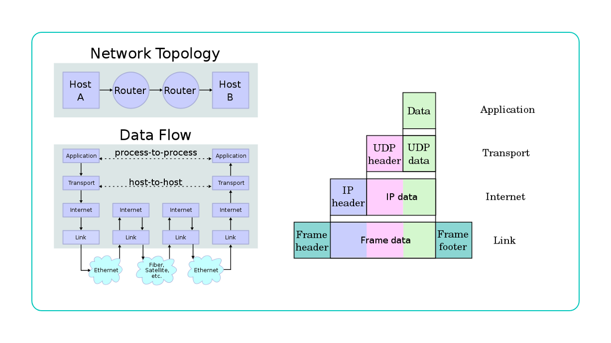

# Chapter1: IP Address

この章では TCP/IP でノードの識別子として用いられる IP アドレスに関する基礎知識とその設定を学びます。

[[toc]]

## Lesson

### Internet

*The Internet*は、ARPANET と呼ばれる 4 つのノードを接続した小さなネットワークから発展し、今では全世界を接続する巨大なコンピューターネットワークのことを指します。

インターネットの構造は、根本的には ARPANET の時代と変化しておらず、ネットワークとネットワークが接続されることで形成されています。

数台の機器によって構成される小さなネットワーク同士が接続し、組織内のネットワークを構成し、組織同士のネットワークが接続することで地域のネットワークが形成されます。
そして地域のネットワーク同士が接続され、最終的には世界中を結ぶ*The Internet*が形作られます。
このように、インターネットは階層的な構造を持っています。

### TCP/IP

TCP/IP(Internet protocol suite)は、インターネットを含む多くのコンピューターネットワークに置いて標準的に用いられる通信プロトコルのセットです。



IP アドレスは TCP/IP の Internet Protocol において各ノードを識別するために用いられる識別子で、今回は IPv4 を使用します。

IPv4 アドレスは 32bit の数値で表され、ネットワークを指定する**ネットワーク部**(上位)とそのネットワーク内の機器を指定する**ホスト部**(下位)に分けられます。
通常は 32bit を 8bit ずつにドット`(.)`で区切って、10 進法表記したものが用いられ、上位から何 bit がネットワーク部にあたるかを`/`の後に表記します(この値をサブネットマスクという)。


- `172.16.254.1 = 10101100.00010000.11111110.00000001`\
- `172.16.254.1/24 = 10101100.00010000.11111110(←ここまでネットワーク部).00000001`

::: info
- ホスト部がすべて 0 のアドレスは**ネットワークアドレス**として予約済み
- ホスト部がすべて１のアドレスは**ブロードキャストアドレス**として予約済み
- 127.0.0.1 は**ループバックアドレス**として予約済み
:::
## Assignment

割り当てられたネットワークの構成については[docs](/docs/topology.md)を参照してください。

### 1. rEXとr1の間でpingによる疎通確認ができるようにしてみよう

::: details ヒント1

`ping`は ICMP を使用したネットワークの診断プログラムです。
ICMP は「エラー通知」や「制御メッセージ」を転送するためのプロトコルで、IP 上で動作します。
そのため、IP 上での通信を行える必要があります。

直接接続された NIC 同士は互いを認識できますが、初期状態では IP アドレスが割り振られていないことに注意しましょう。
:::

::: details ヒント2

最初に決める必要があるのは、rEX の eth10 と r1 の eth12 に割り振るネットワークの範囲です。
この場合、ネットワークの大きさは`.0/30`で良いでしょう。
:::

::: details ヒント3

「VyOS IP アドレス設定」などで検索してみると良いでしょう。
:::

::: details 答え

[rEX]
```sh
root@hijiki51-60000:/# attach rEX
minion@rEX:/$ config
[edit]
minion@rEX# set interfaces ethernet eth10 address 192.168.XXX.1/30
[edit]
minion@rEX# commit
[edit]
minion@rEX# save
Done
[edit]
minion@rEX# exit
exit
minion@rEX:/$ exit
exit
```

[r1]
```sh
root@hijiki51-60000:/home/hijiki51# attach r1
minion@r1:/$ config
[edit]
minion@r1# set interfaces ethernet eth12 address 192.168.XXX.2/30
[edit]
minion@r1# commit
[edit]
minion@r1# save
Done
[edit]
minion@r1# exit
exit
minion@r1:/$ exit
exit
```

:::