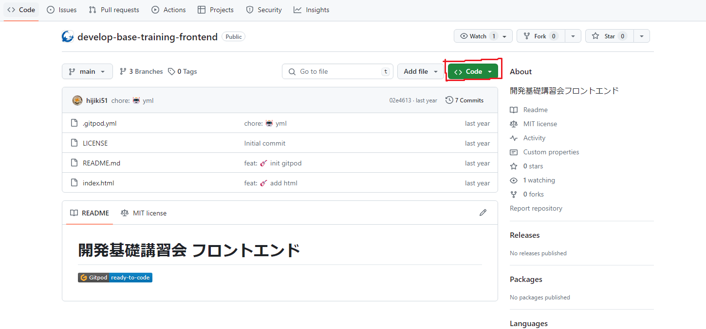
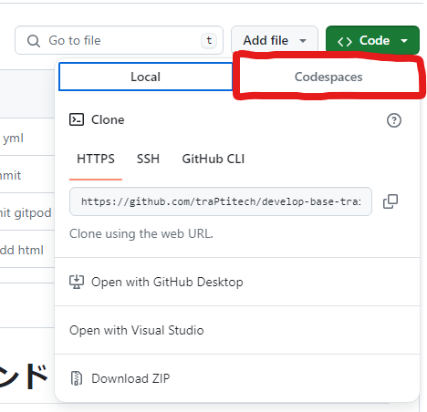
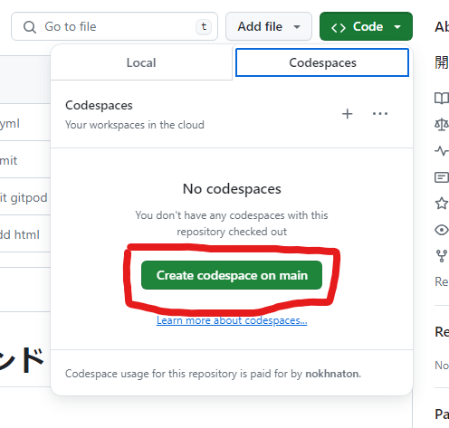
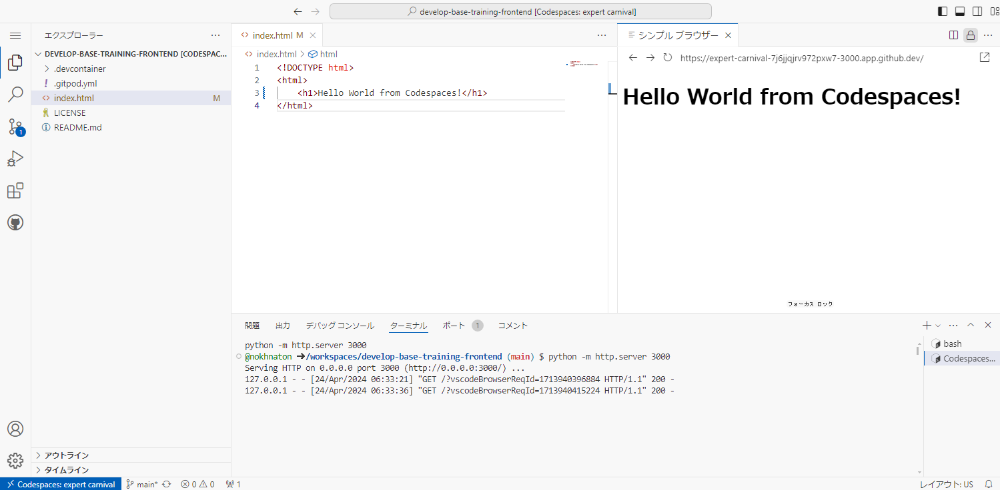
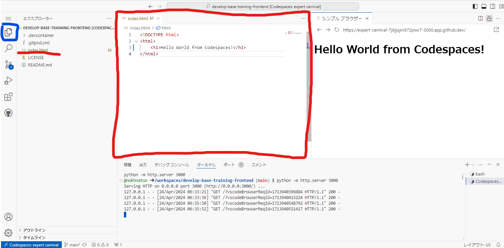
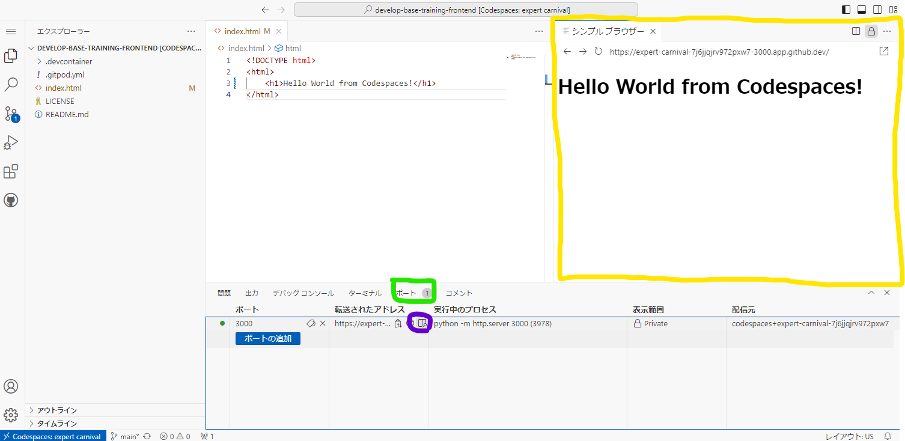
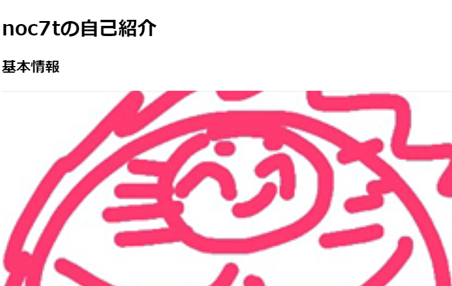
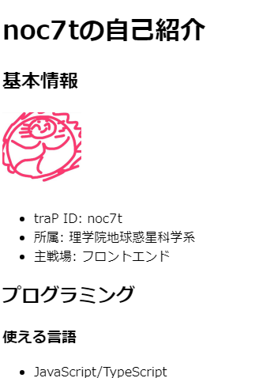
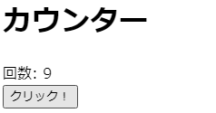
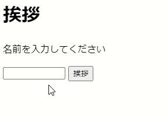

# 第 1 回 | フロントエンド　

## Webページを作る3言語
- HTML
    - ページの**構造**を記述するもの
- CSS
    - ページの**スタイル**を記述するもの
- JavaScript
    - ページの**ロジック**を記述するもの

### HTMLの書き方
- タグを利用して書く
    - <タグ名>\~\~\~\~</タグ名>
- CSS や JavaScript の為に属性や class・id なども書く
- Web ページの起点になるものでメタ情報や読み込む外部ファイルも記述する
- 詳しくはググろう
    - **概要: https://developer.mozilla.org/ja/docs/Web/HTML**
    - 仕様書: https://html.spec.whatwg.org/multipage/

### CSSの書き方
- style タグの内側か link タグで読み込んで使う
- セレクタで対象を指定して対象に対してスタイルを記述する
- いろんな書き方・テクニックが存在する
- Devtools で見て、試して学んでいこう
- ググるといっぱい出てくる
    - **概要: https://developer.mozilla.org/ja/docs/Web/CSS**
    - 仕様書: https://www.w3.org/Style/CSS/specs.en.html

### JavaScriptの書き方
- script タグの内側か script タグで読み込んで使う
- 何でもできる
    - **概要: https://developer.mozilla.org/ja/docs/Web/JavaScript**
    - 仕様書: https://developer.mozilla.org/en-US/docs/Web/JavaScript/Language_Resources


## 実際にページを作る
### GitHub Codespacesの開き方
今回は開発環境として GitHub Codespaces を使います。

#### Githubアカウントを作る
以下を参考にしながら、作成してください
https://qiita.com/ayatokura/items/9eabb7ae20752e6dc79d 

#### GitHub Codespacesを起動する

https://github.com/traPtitech/develop-base-training-frontend
↑にアクセスします。

すると下のような画面が出てくるので、赤丸で囲んだ部分(<> Code)をクリックします。


"Codespaces" をクリックします。


最後に"Create codespaces on main" をクリックします。

暫く待つと…起動できました!!


:::details Codespaces内のウィンドウを閉じてしまった時
##### ファイルを編集するウィンドウを閉じてしまった時
html ファイルなどを編集するウィンドウ(赤枠で囲ったようなウィンドウ)を閉じてしまった場合は、「エクスプローラー」内の赤で下線を引いたような該当するファイル名をクリックしてください。「エクスプローラー」が見当たらない場合は、青枠で囲った部分をクリックすると表示されるはずです。


##### htmlを表示するウィンドウ(シンプル ブラウザー)を閉じてしまった時

html ファイルなどを表示するウィンドウ(黄枠で囲ったようなウィンドウ)を閉じてしまった場合は、下の方にある緑で囲った「ポート」をクリックし、紫で囲んだアイコンをクリックしてください。(カーソルを合わせるとアイコンが現れるはずです!)

:::


#### GitHub Codespacesの止め方

GitHub Codespaces は実行時間に対して無料枠が決まっているので、起動したままだと、すぐに無料枠が尽きてしまいます。なので、使い終わったら止めましょう（データは消えません）。
（1）から（4）の順番に選択することで止めることができます。


:::warning
Delete を選択するとデータも消えてしまうので注意してください。
また、デフォルトでは、30 日起動させないと削除されます。どうしても削除されたくない場合は、 "Auto-delete codespace" のチェックボックスを外してください。
:::


しばらく待つと、左の緑色だった丸が無くなり、停止されたのがわかります。

### HTMLを書く
それでは、実際に作っていきましょう。

#### index.htmlについて
トップページは慣例的に index.html という名前をつけるのが一般的です。
example.com などのドメイントップにアクセスした時表示されるページは(静的サイトの場合)殆どが index.html です。

#### 初期状態
```html
<!DOCTYPE html>
<html lang="ja">
<head>
    <meta charset="UTF-8">
    <title>noc7tの自己紹介</title>
</head>
<body>
    <!-- ここに内容を書いていきます -->
</body>
</html>
```

ここはおまじないとして書いていきましょう。


### 使いそうなタグの紹介
- h
    - **h**eading
    - h1, から h6 まであります
    - 見出しを作る時
    - SEO(Search Engine Optimization)的には 1 ページに h1 は一個のほうがいいとかいろいろあるらしい
    - https://developer.mozilla.org/ja/docs/Web/HTML/Element/Heading_Elements
- p
    - **p**aragraph
    - 段落わけをする時
    - https://developer.mozilla.org/ja/docs/Web/HTML/Element/p
- div
    - **div**ision
    - とりあえずタグをグループ分けしたいとき
    - CSS を当てる時に重宝します
    - https://developer.mozilla.org/ja/docs/Web/HTML/Element/div
- span
    - とりあえずタグで囲みたい時
    - 行内で使う
    - CSS を当てる時に重宝します
    - https://developer.mozilla.org/ja/docs/Web/HTML/Element/span
- ul
    - **u**nordered **l**ist
    - リストを作りたいときに下の li とセットで使う
    - li たちをこれで囲む
    - ol(**o**rdered **l**ist)もある
    - https://developer.mozilla.org/ja/docs/Web/HTML/Element/ul
- li
    - **l**ist **i**tem
    - リストを作りたいときに上の ul とセットで使う
    - リストのそれぞれの要素をこれで囲む
    - https://developer.mozilla.org/ja/docs/Web/HTML/Element/ul
- img
    - **im**a**g**e
    - 画像を埋め込みたい時
    - https://developer.mozilla.org/ja/docs/Web/HTML/Element/img

### 自己紹介を書いてみる
外部に公開する予定なので個人情報を出したくない人はいい感じにでっち上げてください。

```html
<!DOCTYPE html>
<html lang="ja">
<head>
    <meta charset="UTF-8">
    <title>noc7tの自己紹介</title>
</head>
<body>
    <h1>noc7tの自己紹介</h1>
    <div>
      <h2>基本情報</h2>
      <ul>
        <li>traP ID: noc7t</li>
        <li>所属: 理学院地球惑星科学系</li>
        <li>主戦場: フロントエンド</li>
      </ul>
    </div>
    <div>
    <h2>プログラミング</h2>
    <h3>使える言語</h3>
    <ul>
      <li>JavaScript/TypeScript</li>
      <li>Go</li>
    </ul>
    <h3>使えるライブラリ・フレームワーク</h3>
    <ul>
      <li>Vue</li>
      <li>React</li>
      <li>Next</li>
    </ul>
  </div>
  <p>
    皆さん初めまして！22B の noc7t です！<br>
    リアルで呼ぶときは「ノクナートン」と呼んでください！<br>
   よろしくお願いします！
  </p>
</body>
</html> 

```


### 画像の追加
画像を追加します。
icon.png を追加して、以下の部分に画像表示を追加します。

ディレクトリ構造はこんな感じ。
```
.
├── icon.png
└── index.html
```

```html
  <div>
    <h2>基本情報</h2>
     <!-- 追加 -->
    <ul>
```

こんな感じになりました…でかい



画像がでかい問題を修正するために、CSS を書いていきましょう。

## CSSを書く
スタイルを記述するために CSS を書いていきます。

### CSSを読み込む
style.css というファイルを追加します。

ディレクトリ構造はこんな感じになっているはずです。
```
.
├── icon.png
├── index.html
└── style.css
```

index.html で読み込みます。
外部ファイルは基本的に head タグ内で読み込みます。
```html
<head>
  <meta charset="UTF-8">
  <!-- ./以下にあるstyle.cssをstylesheetとして読み込みますよと言う意味 -->
  <link rel="stylesheet" href="./style.css">
  <title>hijiki51の自己紹介</title>
</head>
```

### スタイルを書く
実際に style.css を書いていきましょう。
最初はあのでかい画像のサイズを変更するようにします。

まず index.html 側でセレクタのために id を指定します。
```html
  <div>
    <h2>基本情報</h2>
    
    <ul>
      <li>traP ID: hijiki51</li>
      <li>所属: 理学院物理学系</li>
```


そのセレクタを指定して`style.css`にスタイルを記述します。
```css=
#icon {
  width: 100px;
}
```

無事小さくなりました。


### みんなに自慢してみよう

ここまでできたら自己紹介ページのスクリーンショットを貼ってください。

Mac: control + shift + command + 4 で矩形選択でスクリーンショットが撮れます。traQ のメッセージ入力欄に Command+v で貼り付けられます。
Windows: Win キー + shift + s で矩形選択でスクリーンショットが撮れます。traQ のメッセージ入力欄に ctrl+v で貼り付けられます。


## JavaScriptを書く
JavaScript を書いていきます。
簡単なものとして、カウンターを作ってみましょう。


#### index.html
```html
<!DOCTYPE html>
<html lang="ja">
<head>
  <meta charset="UTF-8">
  <link rel="stylesheet" href="./style.css">
  <script src="./counter.js"></script>
  <title>noc7tの自己紹介とカウンター</title>
</head>
<body>
  <!-- 省略 -->
  <h1>カウンター</h1>
  <div id="count">回数: 0</div>
  <button onclick="countUp()">クリック！</button>
</body>
</html>
```

#### counter.js
```javascript
let count = 0
const countUp = () => {
  count++
  const countElement = document.querySelector('#count')
  countElement.innerText = '回数: ' + count
}
```

これらを書くことでカウンターのボタンをクリックすると回数が上がるようになるでしょう。


### コード解説
#### index.html
```html
<!DOCTYPE html>
<html lang="ja">
<head>
  <meta charset="UTF-8">
  <link rel="stylesheet" href="./style.css">
  <script src="./counter.js"></script>
  <title>noc7tの自己紹介とカウンター</title>
</head>
<body>
  <!-- 省略 -->
  <div>
    <h1>カウンター</h1>
    <div id="count">回数: 0</div>
    <button onclick="countUp()">クリック！</button>
  </div>
</body>
</html>
```

- 6 行目
    - JS ファイルの読み込み
- 11 行目
    - 回数の表示する部分
    - id を設定して、JavaScript 側から見つけられるように
- 14 行目
    - ボタン
    - クリック時に動作する関数(処理のかたまり)を指定
    - 関数は JS ファイル内に書いてある

#### counter.js

```javascript
let count = 0;
const countUp = () => {
  count++;
  const countElement = document.querySelector('#count');
  countElement.innerText = '回数: ' + count;
};
```

- 1 行目
    - クリックした回数を保存する変数を定義
- 2-6 行目
    - クリック時に動作する関数の定義
    - アロー関数式という、最新の JavaScript 特有の関数の書き方
- 4 行目
    - id が count の要素(= counter.html の 10 行目の要素)を取得
    - `document.querySelector`で指定するのはセレクタ(CSS でも使う)形式
- 5 行目
    - 指定した要素の中身であるテキストを上書き


**ここまで理解できた人は、カウントをリセットするボタンを追加してみましょう**


## 課題
名前を入力するとその名前に対して挨拶をしてくれるようにしてみよう！
↓動作例


### 使いそうなタグの紹介
- input
    - 入力フォーム
    - 文字数制限できたり、割と高機能
    - https://developer.mozilla.org/ja/docs/Web/HTML/Element/input


:::details ヒント

```
document.querySelector("#name").value;
```
で、`id=name`の`input`の中にある文字を取得できます。


### 実装例
https://github.com/traPtitech/develop-base-training-frontend/tree/sample

:::


## まとめ
今日は超基本的な HTML/CSS/JavaScript について学びました。
実際に Web 上で自分のページを公開もしました。
みなさんは世界に対して自分の世界を公開できるようになったのです!!!!

更に詳しい書き方はどんどん調べて書いてみて試してみましょう！


## 発展課題
今回作ったカウンターとあいさつを別のページにしてみましょう！

実装例：https://github.com/traPtitech/develop-base-training-frontend/tree/extra
