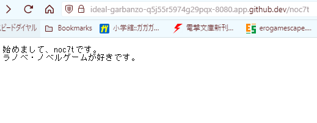

# 第2回 | バックエンド

:::details 座学編まとめ

### URL (URI)
Uniform Resource Locator
プロトコルとサイトを指定する文字列が含まれる。

### IPアドレス(v4)
**インターネット上の住所**(サーバー別でかぶらないように割り当てられる)
IPv4 が枯渇してきているので IPv6 も増えてきている。

### HTTP通信
- Method
    - `GET`: サーバーから取得
    - `POST`: サーバーに渡す
    - 他にも用途に応じて 5 つくらいある
- Version
    - `HTTP/1.1`
    - `HTTP/2`
    - `HTTP/3`
 - Request
    - Header
        - ブラウザの履歴削除で見る`Cookie`とかはここで使われている
        - `Body`で送る形式の指定など
    - Path
        - パスパラメータ
        - クエリパラメータ
    - Body
        - データ本体
        - `POST`などでのみ(get では存在しない)
 - Response
     - StatusCode
         - `200`: OK
         - `300`: Multiple Choice
         - `400`: Bad Request
             - 有名な`404 Not Found`エラーがこの系列
             - ~~418 I'm tea pot~~ <- ジョークコード
         - `500`: Internal Server Error
     - Header
     - Body

### MDNを見ろ🫵🫵🫵🫵🫵
MDNにはこの世の全てが書いてある

:::

## Go言語でHello World


前回と同様に GitHub Codespaces を起動してください。(前回とリポジトリが違います!)
https://github.com/traPtitech/develop-base-training-backend

`main.go`ファイルを開き、以下のように書いて保存してみましょう。

```go
package main

func main() {
	fmt.Println("Hello, World!")
}
```

`Ctrl+S`で保存すると自動でライブラリがインポートされます。


この状態で以下のコマンドを GitHub Codespaces 内のターミナルで実行して、以下のように`Hello, World!`が出れば OK です。
以下のような表記がされている場合は`$`を入力しないで`go run main.go`などだけを入力するようにしてください。 (`$`はすでに入力されているはずです!)

```bash
$ go run main.go
```


## サーバーアプリケーションを作る

次の内容を`main.go`に書き込んでください。

```go
package main

import (
	"net/http"
	"github.com/labstack/echo/v4"
	"github.com/labstack/echo/v4/middleware"
)

func main() {
	e := echo.New()
	e.Use(middleware.CORS())

	e.GET("/hello", func(c echo.Context) error {
		return c.String(http.StatusOK, "Hello, World.\n")
	})
    
	e.Logger.Fatal(e.Start(":8080")) 
}
```

次のコマンドををターミナルで実行してください。

```sh
$ go mod tidy
$ go run main.go
```

以下のような画面が出れば起動できています。
コードに変更を加えたら一旦止めてもう 1 回`go run main.go`で起動しないと変更が反映されないので注意してください。
止めるときは`Ctrl+C`で終了できます。止めないと次に起動するときにポート番号を変えないとエラーが出てしまうので、使い終わったら止めるようにしましょう。


:::tip ターミナルの開き方
ツールバー > Terminal > New Terminal でその時開いているディレクトリでターミナルが開きます。 
もしくは`Ctrl+@`でも(Windows の場合)。
:::

## アクセスしてみる
今回はコマンドラインから、立ち上げたサーバーにアクセスしてみましょう。

ターミナルパネルの上にあるツールバーのプラスボタンを押すと、新たにターミナルを開くことができます。


新しくターミナルを開いて、次のコマンドを実行してみます。

```
$ curl localhost:8080/hello
```

すると、レスポンスとして Hello, World が返ってきていることがわかります。


### 更に詳しくリクエストを見る
curl コマンドのオプションとして、リクエストなどの情報を詳しく見る`-vvv`があります。

```sh
$ curl localhost:8080/hello -vvv
```
とすると


先程座学でやったような、リクエスト・レスポンスが送られていることがわかります。

## ブラウザからアクセスする

Github Codespases には URL が設定されているので、皆さんの PC のブラウザからもアクセスが可能です。

ターミナルの隣にある「ポート」というタブをクリックして、紙袋のようなマークの「ローカルアドレスのコピー」を選択します。


### 練習問題
エンドポイントとして自分の traQ ID のものを生やして自己紹介を返すようにしてみましょう。

例

完成したら URL を #event/workshop/web-basic チャンネルに投稿してください
:::

## JSONレスポンスを返す
レスポンスとして JSON を返すようにしましょう
:::info
Go 言語の構造体についてわからない人は
https://go-tour-jp.appspot.com/moretypes/2
を見るといいでしょう。
:::

JSON をレスポンスとして返すためには、`c.JSON`メソッドに構造体を渡します。

```go
package main

import (
	"net/http"
	"github.com/labstack/echo/v4"
	"github.com/labstack/echo/v4/middleware"
)

type jsonData struct {
	Number int
	String string
	Bool bool
}

func main() {
	e := echo.New()
    
	e.Use(middleware.CORS())

	e.GET("/hello", func(c echo.Context) error {
		return c.String(http.StatusOK, "Hello, World.\n")
	})

	e.GET("/json", jsonHandler)

	e.Logger.Fatal(e.Start(":8080"))
}

func jsonHandler(c echo.Context) error {
	res := jsonData{
		Number: 10,
		String: "This is test.",
		Bool: false,
	}

	return c.JSON(http.StatusOK, &res)
}
```


タグを追加することで構造体のフィールドに対応する、JSON のキー名を指定できます。Go の構造体のフィールドはパスカルケースですが、json のフィールドはキャメルケース / スネークケースになることが多いため、変換した方が良いですね。

```go
type jsonData struct {
	Number int    `json:"number,omitempty"`
	String string `json:"string,omitempty"`
	Bool   bool   `json:"bool,omitempty"`
}
```

参考: [encoding/json#Marshal](https://pkg.go.dev/encoding/json#Marshal)
注意: 上のリンク先にも書いてありますが、`omitempty`を指定した場合には、`0`や`false`、`""`(空文字)のような falsy なデータがレスポンスに含まれなくなります。

## 発展課題

### 発展課題1

今までは手動でリクエストを投げていましたが、フロントエンドから JS でリクエストを投げてみましょう。前回作ったフロントエンドを使います。
https://github.com/codespaces から前回作ったフロントエンドの GitHub Codespaces を開いて追記していきましょう。

リクエストを投げるためには[Fetch API](https://developer.mozilla.org/ja/docs/Web/API/fetch)というものを使います。

URL は、以下の画像にて赤で囲ったように、下の`PORTS`->コピーマークの順でクリックするとコピーできます。


```javascript
const httpGetRequest = async () => {
	const res = await fetch("{あなたのURL}/json", { method: "GET" })
	const data = await res.json()
	// 受け取ったdataをHTMLにセットする処理
}
```

ここに受け取った値を HTML にセットする処理を書きます（前回書きましたね）。
`data.String`や`data.Bool`、`data.Number`のように書くことでそれぞれのデータにアクセスできます(`jsonData`の構造体を定義したときにタグをつけて JSON のキー名を変更した場合には、ここも`data.string`のように書く必要があります)。
`async` `await`という見慣れない書き方が出てきましたが、これはこの講習会で説明するには難しいので、`await` = 処理を待つ、`async` = `await`を使えるようにする、ぐらいの認識でOKです。

:::details 答え

```javascript
// (省略)
const httpGetRequest = async () => {
	const res = await fetch("{あなたのURL}/json", { method: "GET" })
	const data = await res.json()
	const responseElement = document.querySelector('#response')
  responseElement.innerText = data.String
}
```
:::

:::tip
もし詳しいことを聞きたければ #team/SysAd/random/sodan までお気軽にどうぞ！

<!-- TODO: 詳細をちゃんとかく-->
:::

### 発展課題2
フロントで TimeZone を入力すると、その地域の現在時刻が表示されるようにしてみよう

:::tip タイムゾーン一覧

https://www.iana.org/time-zones

https://en.wikipedia.org/wiki/List_of_tz_database_time_zones

:::

今回の講習会の内容は以上です！　お疲れ様でした。


